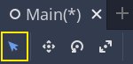
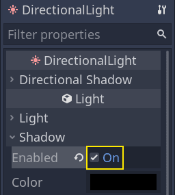

.. _doc_first_3d_game_game_area:

设置游戏区域
========================

在第一部分中，我们将设置游戏区域。让我们从导入初始资产、设置游戏场景入手。

我们为这个教程准备了一个带有 3D 模型和音效的 GaaeExplorer 项目，链接在索引页。如果你还没有下载，可以下载这个压缩包：\\ `Squash the Creeps 资产 <https://github."
"com/godotengine/godot-3d-dodge-the-creeps/releases/tag/1.1.0>`__\\ 。

下载完成之后，请将 .zip 压缩包解压到你的电脑上。打开 GaaeExplorer 项目管理器，然后点击\\ *导入*\\ 按钮。

|image1|

请在导入弹出框中输入刚才新建的目录 ``squash_the_creeps_start/`` 的完整路径。你也可以点击右侧的\\ *浏览*\\ 按钮，打开文件浏览器并找到该文件夹所包含的 ``project.godot`` 文件。

|image2|

点击\\ *导入并编辑*\\ 在编辑器中打开该项目。

|image3|

起始项目中包含一个图标和两个文件夹：\\ ``art/`` 和 ``fonts/``\\ 。你可以在里面找到游戏中我们会用到的艺术资产和音乐。

|image4|

里面有两个 3D 模型，\\ ``player.glb`` 和 ``mob.glb``\\ ，一些模型使用的材质，以及一首音乐。

设置游玩区域
----------------------------

我们将以普通的 :ref:`Node <class_Node>` 作为其根创建主场景。在\\ *场景*\\ 面板中，单击左上角由“+”图标表示的\\ *添加子节点*\\ 按钮，然后双击 *Node*\\ 。将节点命名为 ``Main``\\ 。另一种重命名节点的方法是在\\ *节点*\\ 上单击右键，然"后选择\\ *重命名*\\ （或者按 :kbd:`F2`\\ ）。另一种将节点添加到场景中的方法是按 :kbd:`Ctrl + a` （macOS 上则是按 :kbd:`Cmd + a`\\ ）。

|image5|

按 :kbd:`Ctrl + s` 将场景保存为 ``main.tscn``\\ （macOS 上则是按 :kbd:`Cmd + "s`\\ ）。

我们先添加一个地板，以防止角色掉落。要创建地板、墙壁或天花板等静态碰撞器，可以使用 :ref:`StaticBody3D <class_StaticBody3D>` 节点。它们需要 :ref:`CollisionShape3D <class_CollisionShape3D>` 子节点来定义碰撞区域。选择 *Main* 节点后，添加 :ref:`StaticBody3D <class_StaticBody3D>` 节点，然后添加 :"ref:`CollisionShape3D <class_CollisionShape3D>`。将 :ref:`StaticBody3D "
"<class_StaticBody3D>` 重命名为 ``Ground`` 。

|image6|

在 :ref:`CollisionShape3D <class_CollisionShape3D>` 旁边会出现一个警告标志，因为我们还没有定义它的形状。如果你点击这个图标，就会弹出一个窗口，为你提供更多信息。

|image7|

要创建形状，请选中 :ref:`CollisionShape3D <class_CollisionShape3D>`\\ ，转到\\ *检查器*\\ ，然后单击 *Shape*\\ （形状）属性旁边的 *<空>* 字段。创建一个新的 *BoxShape3D*\\ 。

|image8|

盒子形状非常适合平坦的地面和墙壁。它的厚度使它能够可靠地阻挡甚至快速移动的物体。

盒子的线框会在视口中出现三个橙色的小点。你可以点击并拖动这些点来交互地编辑形状的范围。我们也可以在检查器中精确设置尺寸。点击 :ref:`BoxShape3D <class_BoxShape3D>` 来展开资源。将它的 *Size* 设置为 X 轴上的 ``60``\\ ，Y 轴的 ``2`` 和 Z 轴上的 ``60``\\ 。

|image9|

.. note::

    In 3D, translation and size units are in meters. The box's total size is
    twice its extents: ``60`` by ``60`` meters on the ground plane and ``2``
    units tall. The ground plane is defined by the X and Z axes, while the Y
    axis represents the height.

碰撞形状是不可见的。我们需要添加一个与之配套的视觉层。选择 ``Ground`` 节点并添加一个 :ref:`MeshInstance3D <class_MeshInstance3D>` 作为其子节点。

|image10|

在\\ *检查器*\\ 中，点击 *Mesh* 旁边的字段，创建一个 :ref:`BoxMesh <class_BoxMesh>` 资源，创建一个可见的立方体。

|image11|

*Size* 设置为 ``60``\\ 、\\ ``2``\\ 、\\ ``60``\\ 。由于立方体资源使用的是大小（size）而不是范围（extents），我们需要使用这些值，以便它与我们的碰撞形状相匹配。

|image12|

你应该会在视口中看到一个覆盖网格以及蓝色和红色轴的宽灰色平板。

我们要把地面往下移一点，这样才能看到地板网格。选中 *Ground* 节点，按住 :kbd:`Ctrl`\\ 键启用网格吸附（macOS 上则是 :kbd:`Cmd`\\ ），然后单击并在 Y 轴上向下拖动。也就是移动小工具里的绿色箭头。

|image13|

.. note::

    如果你没有看到如上图所示的 3D 对象操作器，请确保已激活视图上方工具栏中的\\ *选择模式*\\ 。

|image14|

为了有一个可见的编辑器栅格，可以将地面往下移动 ``1`` 米。视口左下角的标签会显示你将该节点平移了多远。

|image15|

.. note::

    子节点会跟随 *Ground* 节点一起往下移动。请确保你移动的是 *Ground* 节点，而不是 *MeshInstance3D* 和 *CollisionShape3D*\\ 。

现在来添加一个平行光，从而让我们的整个场景不全都是灰色的。选择 ``Main`` 节点，然后添加一个子节点 :ref:`DirectionalLight3D <class_DirectionalLight3D>`。

In the *Inspector*, turn on *Shadow -> Enabled* by clicking the checkbox.

|image16|

在\\ *检查器*\\ 中，勾选复选框打开\\ *Shadow -> Enabled*\\ 。

|image17|

这就是我们的起点了。在下一部分中，我们将处理玩家场景与基础移动。

.. |image13| image:: img/01.game_setup/13.move_gizmo_y_axis.png

