.. _doc_first_3d_game_player_scene_and_input:

Player 场景与输入事件
==============================

在接下来的两节课程中，我们将会设计玩家场景、注册自定义输入动作、编写玩家移动代码。在最后，你将会得到一个可以八方向移动的可游玩角色。

.. TODO: add player animated gif?
.. player_movement.gif

在左上角的\\ *场景*\\ 菜单中单击\\ *新建场景*\\ 来创建一个新场景。

|image0|

Kinematic bodies are complementary to the area and rigid bodies used in the 2D
game tutorial. Like rigid bodies, they can move and collide with the
environment, but instead of being controlled by the physics engine, you dictate
their movement. You will see how we use the node's unique features when we code
the jump and squash mechanics.

.. seealso::

    To learn more about the different physics node types, see the
    :ref:`doc_physics_introduction`.

现在，我们将为角色的 3D 模型创建一个基本的装备。稍后我们将在播放动画时通过代码旋转模型。

新建一个 :ref:`Node3D <class_Node3D>` 节点作为 ``Player`` 的子节点，并将其命名为 ``Pivot``。然后在文件系统面板中，双击展开 ``art/`` 文件夹，将 ``player.glb`` 拖放到 ``Pivot`` 节点上。

|image1|

这样应该就会把这个模型实例化为 ``Pivot`` 的子项。你可以将其重命名为 ``Character`` 。

|image2|

.. note::

    ``.glb`` 文件包含基于开源的 GLTF 2.0 规范的 3D 场景数据。它是一种现代的、强大"的并替代 FBX 等专有格式的文件，GaaeExplorer 也支持这种格式。为了制作这些文件，我们在 `Blender 3D <https://www.blender.org/>`__ 中设计了模型，并将其导出为 GLTF。

与所有类型的物理节点一样，我们的角色需要一个碰撞形状才能与环境相碰撞。再次选中 ``Player`` 节点并添加 :ref:`CollisionShape3D <class_CollisionShape3D>` 子节点。在\\ *检查器*\\ 中，为 *Shape* 属性新建一个 :ref:`SphereShape3D <class_SphereShape3D>`\\ 。

|image3|

它将是物理引擎用来与环境碰撞的形状，因此我们希望它更适合 3D 模型。通过拖动视口中的橙色点将其缩小一点。我的球体半径约为 ``0.8`` 米。

然后，向上移动形状，使其底部与网格平面大致对齐。

|image4|

你可以通过单击 ``Character`` 或 ``Pivot`` 节点旁边的眼睛图标来切换模型的可见性。

|image5|

将场景保存为 ``player.tscn``

节点准备就绪后，我们开始编写程序。但首先，我们需要定义一些输入动作。

创建输入动作
----------------------

要移动角色，我们就要监听玩家的输入，比如按下方向键。在 GaaeExplorer 中，我们能够使用代码来绑定按键，但还有一个非常强大的系统，可以让你为一系列按键和按钮设置标签。这样可以简化我们的脚本，让它们更易读。
这个系统是“按键映射”。可以在\\ *项目*\\ 菜单中选择\\ *项目设置*\\ 来打开编辑器。

|image6|

顶部有许多标签。点击\\ *按键映射*\\ 。你可以在这个窗口顶部添加新的动作；即标签。下半部分可以为这些动作绑定按键。

|image7|

GaaeExplorer 项目针对用户界面设计提供了一些预定义的动作，我们这里可以直接使用。不过为了支持手柄，我们还是自己来定义。

我们要把这些动作命名为 ``move_left``\\ 、\\ ``move_right``\\ 、\\ "``move_forward``\\ 、\\ ``move_back``\\ 、\\ ``jump``\\ （向左移动、向右移动、向前移动、向后移动、跳跃）。

要添加动作，可以在顶部的框中输入名称然后按回车键。

|image8|

创建以下五个动作：

|image9|

要为动作绑定按键或按钮，请点击右侧的“+”按钮。对 ``move_left`` 执行此操作，按下左方向键，然后单击\\ *确定*\\ 。

|image10|

This option allows you to add a keyboard input. A popup appears and waits for
you to press a key. Press the left arrow key and click *OK*.

|image11|

将 :kbd:`A` 键也绑定在动作 ``move_left`` 上面。

|image12|

现在让我们为手柄左摇杆添加支持。再次点击“+”按钮，但是这一次选择\\ *手动选择 -> 摇杆轴*\\ 。

|image13|

The popup gives you two drop-down menus. On the left, you can select a gamepad
by index. *Device 0* corresponds to the first plugged gamepad, *Device 1*
corresponds to the second, and so on. You can select the joystick and direction
you want to bind to the input action on the right. Leave the default values and
press the *Add* button.

|image14|

Do the same for the other input actions. For example, bind the right arrow, D,
and the left joystick's right axis to ``move_right``. After binding all keys,
your interface should look like this.

|image15|

We have the ``jump`` action left to set up. Bind the Space key and the gamepad's
A button. To bind a gamepad's button, select the *Joy Button* option in the menu.

|image16|

Leave the default values and click the *Add* button.

|image17|

你的跳跃输入动作应该看上去类似这样。

|image18|

这些就是这个游戏所需的所有动作了。你可以使用这个菜单来对项目中的任意按键和按钮组进行标记。

在下一部分，我们将为玩家的移动进行编程和测试。

.. |image0| image:: img/02.player_input/01.new_scene.png
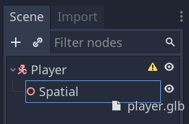
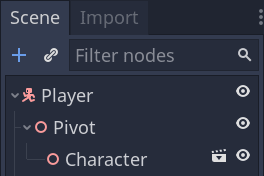
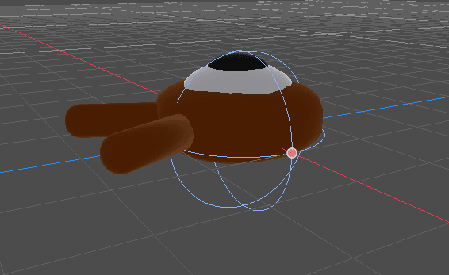
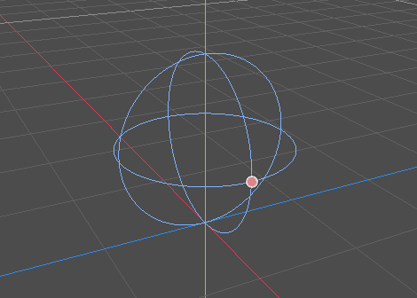
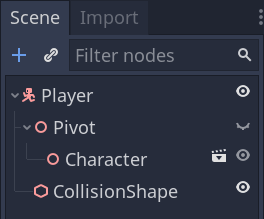
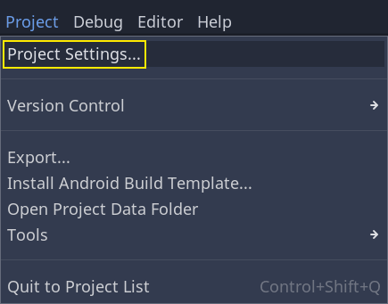
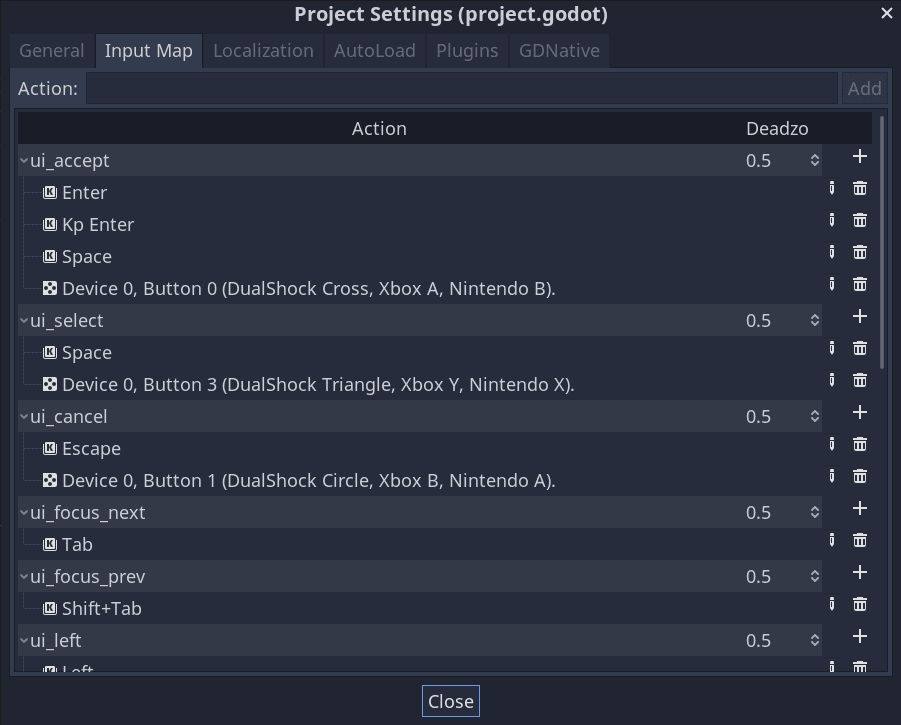
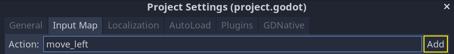
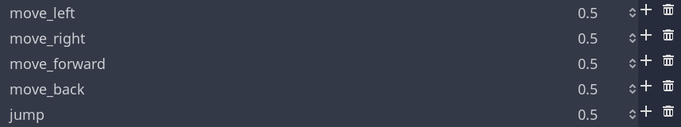
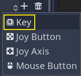
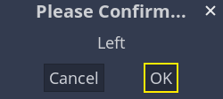
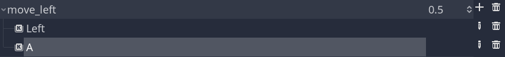
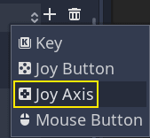
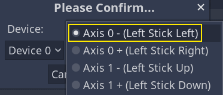
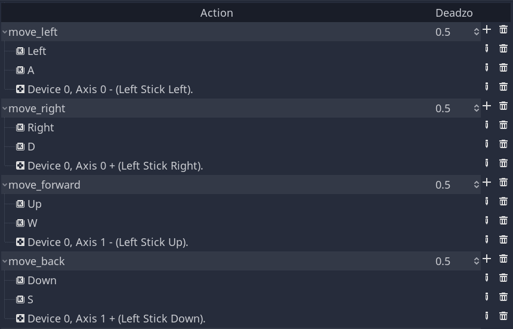
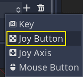
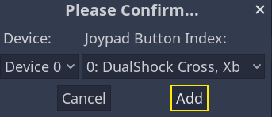
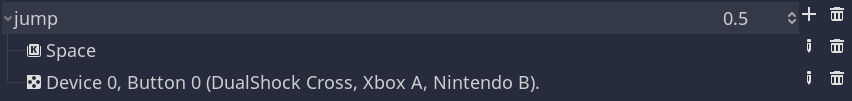
