.. _doc_first_3d_game_player_movement:

使用代码移动玩家
===========================

该轮到编写代码了！我们将使用先前创建的输入动作来移动角色。

右键单击 ``Player`` 节点，选择\\ *附加脚本*\\ 为其添加一个新脚本。在弹出窗口中，先将\\ *模板*\\ 设置为 *空*\\ ，后按下\\ *创建*\\ 按钮 。

|image0|

先定义类的属性。我们将定义移动速率（标量）、重力加速度，以及一个我们将用来移动角色的速度（向量）。

.. tabs::
 .. code-tab:: gdscript GDScript

   extends KinematicBody

   # How fast the player moves in meters per second.
   export var speed = 14
   # The downward acceleration when in the air, in meters per second squared.
   export var fall_acceleration = 75

   var velocity = Vector3.ZERO

 .. code-tab:: csharp

    public class Player : KinematicBody
    {
        // Don't forget to rebuild the project so the editor knows about the new export variable.

        // How fast the player moves in meters per second.
        [Export]
        public int Speed = 14;
        // The downward acceleration when in the air, in meters per second squared.
        [Export]
        public int FallAcceleration = 75;

        private Vector3 _velocity = Vector3.Zero;
    }

这是一个移动物体的常见属性。 ``target_velocity`` 是一个组合了速度和方向的 :"ref:`3D 向量 <class_Vector3>`。在这里，我们将其定义为属性，因为我们希望在帧之间更新并重用其值。

.. note::

    这些值与二维代码完全不同，因为距离以米为单位。在 2D 中，一千个单位（像素）可能只对应于屏幕宽度的一半，而在 3D 中，它是一千米。

那么来编写移动的代码。首先在 ``_physics_process()`` 中使用全局 ``Input`` 对象来计算输入方向向量。

.. tabs::
 .. code-tab:: gdscript GDScript

   func _physics_process(delta):
       # We create a local variable to store the input direction.
       var direction = Vector3.ZERO

       # We check for each move input and update the direction accordingly.
       if Input.is_action_pressed("move_right"):
           direction.x += 1
       if Input.is_action_pressed("move_left"):
           direction.x -= 1
       if Input.is_action_pressed("move_back"):
           # Notice how we are working with the vector's x and z axes.
           # In 3D, the XZ plane is the ground plane.
           direction.z += 1
       if Input.is_action_pressed("move_forward"):
           direction.z -= 1

 .. code-tab:: csharp

    public override void _PhysicsProcess(float delta)
    {
        // We create a local variable to store the input direction.
        var direction = Vector3.Zero;

        // We check for each move input and update the direction accordingly
        if (Input.IsActionPressed("move_right"))
        {
            direction.x += 1f;
        }
        if (Input.IsActionPressed("move_left"))
        {
            direction.x -= 1f;
        }
        if (Input.IsActionPressed("move_back"))
        {
            // Notice how we are working with the vector's x and z axes.
            // In 3D, the XZ plane is the ground plane.
            direction.z += 1f;
        }
        if (Input.IsActionPressed("move_forward"))
        {
            direction.z -= 1f;
        }
    }

在这里，我们将使用 ``_physics_process()`` 虚函数进行所有计算。与 ``_process()`` 一样，它允许你每帧更新节点，但它是专门为物理相关代码设计的，例如运动学物体或刚体。

.. seealso::

    To learn more about the difference between ``_process()`` and
    ``_physics_process()``, see :ref:`doc_idle_and_physics_processing`.

我们首先将一个 ``direction`` 变量初始化为 ``Vector3.ZERO``\\ 。然后，我们检查玩家是否正在按下一个或多个 ``move_*`` 输入，并相应地更新矢量的 ``x`` 和 ``z`` 分量。它们对应于地平面的轴。

这四个条件给了我们八个可能性和八个可能的方向。

如果玩家同时按下 W 键 和 D 键，这个向量长度大约为 ``1.4``\\ "。但如果他们只按一个键，则它的长度将为 ``1``\\ "。我们希望该向量的长度保持一致，而不是在对角线上移动得更快。为此，我们需调用其 ``normalize()`` 方法。

.. tabs::
 .. code-tab:: gdscript GDScript

   #func _physics_process(delta):
       #...

       if direction != Vector3.ZERO:
           direction = direction.normalized()
           $Pivot.look_at(translation + direction, Vector3.UP)

 .. code-tab:: csharp

    public override void _PhysicsProcess(float delta)
    {
        // ...

        if (direction != Vector3.Zero)
        {
            direction = direction.Normalized();
            GetNode<Spatial>("Pivot").LookAt(Translation + direction, Vector3.Up);
        }
    }

在这里，我们只在方向的长度大于零的情况下对向量进行归一化，因为玩家正在按某个方向键。

在这种情况下，我们也会得到 *Pivot* 节点并调用其 ``look_at()`` 方法。该方法接"受一个全局坐标系中要注视的空间位置和上方向。在这种情况下，我们可以使用 ``Vector3.UP`` 常量。

.. note::

    节点的局部坐标，如 ``position``\\ ，是相对于它们的父节点而言的。全局坐标，比如 ``global_position``\\ ，是相对于你在视口中可以看到的世界主轴而言的。

在 3D 中，包含节点位置的属性是 ``position``\\ 。加上 ``direction`` 之后，我们就得到了离 *Player* 一米远的观察位置。

然后，更新速度。需要分别计算地面速度和下降速度。请确保 tab 缩进，使行在 
``_physics_process()`` 函数内部，而不在刚编写的条件外部。

.. tabs::
 .. code-tab:: gdscript GDScript

    func _physics_process(delta):
        #...
        if direction != Vector3.ZERO:
            #...

        # Ground velocity
        velocity.x = direction.x * speed
        velocity.z = direction.z * speed
        # Vertical velocity
        velocity.y -= fall_acceleration * delta
        # Moving the character
        velocity = move_and_slide(velocity, Vector3.UP)

 .. code-tab:: csharp

    public override void _PhysicsProcess(float delta)
    {
        // ...

        // Ground velocity
        _velocity.x = direction.x * Speed;
        _velocity.z = direction.z * Speed;
        // Vertical velocity
        _velocity.y -= FallAcceleration * delta;
        // Moving the character
        _velocity = MoveAndSlide(_velocity, Vector3.Up);
    }

对于垂直速度，在每一帧中减去下降加速度乘以增量时间（delta time，每个帧之间的时间，也称帧时间）。这条代码将使角色在没有在地板上或是碰撞地板的情况下，每帧都会下降。

This line of code will cause our character to fall in every frame. This may seem
strange if it's already on the floor. But we have to do this for the character
to collide with the ground every frame.

物理引擎只有在运动和碰撞发生的情况下才能检测到在某一帧中与墙壁、地板或其他物体的相互作用。我们将在后面使用这个属性来编写跳跃的代码。

在最后一行，我们调用了 ``CharacterBody3D.move_and_slide()``\\ ，这是 ``CharacterBody3D`` 类的一个强大方法，可以让你顺利地移动一个角色。如果它在运动过程中撞到了墙，引擎会试着为你把它进行平滑处理。它使用的是 :ref:`CharacterBody3D <class_CharacterBody3D>` 自带的\\ *速度*\\ 值"

The function takes two parameters: our velocity and the up direction. It moves
the character and returns a leftover velocity after applying collisions. When
hitting the floor or a wall, the function will reduce or reset the speed in that
direction from you. In our case, storing the function's returned value prevents
the character from accumulating vertical momentum, which could otherwise get so
big the character would move through the ground slab after a while.

这就是你在地面上移动角色所需的所有代码。

下面是供参考的完整 ``Player.gd`` 代码。

.. tabs::
 .. code-tab:: gdscript GDScript

   extends KinematicBody

   # How fast the player moves in meters per second.
   export var speed = 14
   # The downward acceleration when in the air, in meters per second squared.
   export var fall_acceleration = 75

   var velocity = Vector3.ZERO

   func _physics_process(delta):
       var direction = Vector3.ZERO

       if Input.is_action_pressed("move_right"):
           direction.x += 1
       if Input.is_action_pressed("move_left"):
           direction.x -= 1
       if Input.is_action_pressed("move_back"):
           direction.z += 1
       if Input.is_action_pressed("move_forward"):
           direction.z -= 1

       if direction != Vector3.ZERO:
           direction = direction.normalized()
           $Pivot.look_at(translation + direction, Vector3.UP)

       velocity.x = direction.x * speed
       velocity.z = direction.z * speed
       velocity.y -= fall_acceleration * delta
       velocity = move_and_slide(velocity, Vector3.UP)

 .. code-tab:: csharp

    public class Player : KinematicBody
    {
        // How fast the player moves in meters per second.
        [Export]
        public int Speed = 14;
        // The downward acceleration when in the air, in meters per second squared.
        [Export]
        public int FallAcceleration = 75;

        private Vector3 _velocity = Vector3.Zero;

        public override void _PhysicsProcess(float delta)
        {
            // We create a local variable to store the input direction.
            var direction = Vector3.Zero;

            // We check for each move input and update the direction accordingly
            if (Input.IsActionPressed("move_right"))
            {
                direction.x += 1f;
            }
            if (Input.IsActionPressed("move_left"))
            {
                direction.x -= 1f;
            }
            if (Input.IsActionPressed("move_back"))
            {
                // Notice how we are working with the vector's x and z axes.
                // In 3D, the XZ plane is the ground plane.
                direction.z += 1f;
            }
            if (Input.IsActionPressed("move_forward"))
            {
                direction.z -= 1f;
            }

            if (direction != Vector3.Zero)
            {
                direction = direction.Normalized();
                GetNode<Spatial>("Pivot").LookAt(Translation + direction, Vector3.Up);
            }

            // Ground velocity
            _velocity.x = direction.x * Speed;
            _velocity.z = direction.z * Speed;
            // Vertical velocity
            _velocity.y -= FallAcceleration * delta;
            // Moving the character
            _velocity = MoveAndSlide(_velocity, Vector3.Up);
        }
    }

测试玩家的移动
-----------------------------

将玩家放在 ``Main`` 场景中进行测试，这时，需要先实例化玩家，然后添加相机。 3D 与 2D 不同，如果没有添加摄像机，你将无法看到任何物体。

保存 ``Player`` 场景，然后打开 ``Main`` 场景。可以点击编辑器顶部的 *Main* 选项卡切换。

|image1|

如果场景之前已关闭，请转到 *文件系统* 面板，双击 ``main.tscn`` 文件重新打开。

要实例化 ``Player`` ，可右键单击 ``Main`` 节点，然后选择 *实例化子场景* 。

|image2|

在弹出窗口中，双击 ``player.tscn`` ，角色将显示在视窗的中心。

添加摄像机
~~~~~~~~~~~~~~~

接下来我们来添加摄像机。和 *Player* 的 *Pivot* 类似，我们要创建一个基本的架构。再次右键单击 *Main* 节点，这次选择\\ *添加子节点*\\ 。新建一个 :ref:`Marker3D <class_Marker3D>`\\ ，命名为 *CameraPivot*\\ ，然后添加一个 :ref:`Camera3D <class_Camera3D>` 节点作为其子项。你的场景树应该看起来像这样。

|image3|

请注意在选中 *Camera* 时，左上角会出现一个\\ *预览*\\ 复选框。你可以单击预览游戏中的摄像机投影视角。

|image4|

我们要使用 *Pivot* 来旋转摄像机，让他像被吊车吊起来一样。让我们先拆分 3D 视图，以便在进行自由移动的同时观察摄像机拍摄到的内容。

在视口上方的工具栏中，单击\\ *视图*\\ ，然后单击\\ *2 个视口*\\ 。你也可以按 :kbd:`Ctrl + 2`\\ （macOS 上则为 :kbd:`Cmd + 2`\\ ）。

|image5|

在下面那个视图中，选中 :ref:`Camera3D <class_Camera3D>`\\ ，然后勾选预览复选"
"框打开摄像机预览。

|image6|

在上面那个视图中，将摄像机沿 Z 轴（蓝色）移动 ``19`` 个单位。

|image7|

接下来就是关键。选中 *CameraPivot* 并将其围绕 X 周旋转 ``-45`` 度（使用红色的圆圈）。你会看到摄像机就像是被连上了吊车一样移动。

|image8|

你可以按 :kbd:`F6` 运行场景，然后按方向键来移动角色。

|image9|

因为透视投影的缘故，我们会在角色的周围看到一些空白区域。在这个游戏中，我们要使用的是正交投影，从而更好地展示游戏区域，让玩家更易于识别距离。

再次选中 *Camera*\\ ，然后在\\ *检查器* 中将 *Projection*\\ （投影）设为 *Orthogonal*\\ （正交）、将 *Size*\\ （大小）设为 ``19``\\ 。角色现在看起来应该更加扁平，背景应该被地面充满。

|image10|

With that, we have both player movement and the view in place. Next, we will
work on the monsters.

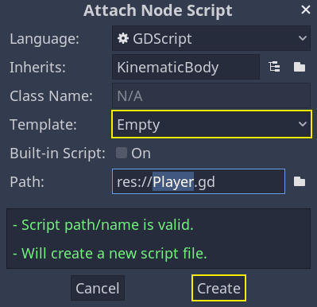
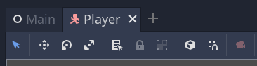
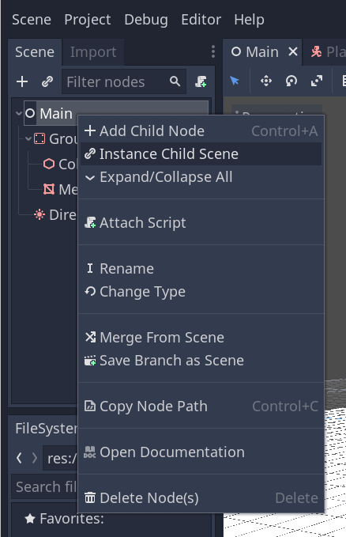
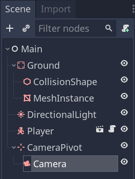
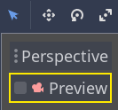
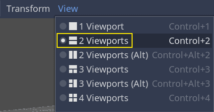
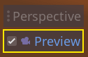
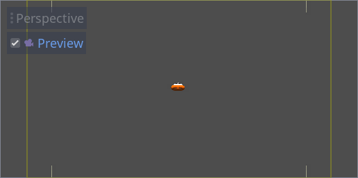
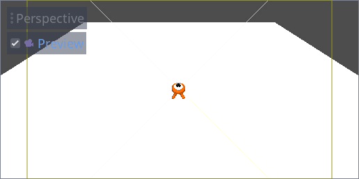
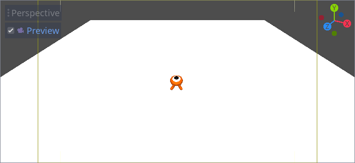
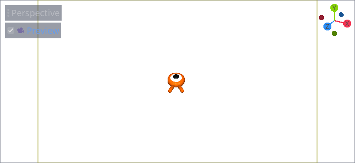
