.. _doc_first_3d_game_designing_the_mob_scene:

设计小怪场景
=======================

在这一部分中，我们要为怪物编写代码，我们后续会称之为“mob”（小怪）。在下一节课中，我们会在游戏区域周围随机生成它们。

让我们在一个新场景中设计这些怪物。节点结构和 ``player.tscn`` 场景类似。

还是用 :ref:`CharacterBody3D <class_CharacterBody3D>` 节点作为根节点来创建场景。命名为 *Mob*\\ 。添加一个 :ref:`Node3D <class_Node3D>` 节点作为其子项，将其命名为 *Pivot*\\ 。将 ``mob.glb`` 文件从\\ *文件系统*\\ 面板拖放到 *Pivot* 上，这样就把怪物的 3D 模型添加到了场景之中。你可以将新创建的 ``mob`` 节点重命名成 ``Character``。

|image0|

我们的实体要添加碰撞形状后才能正常工作。右键单击场景的根节点 *Mob*\\ ，然后单击\\ *添加子节点*\\ 。

|image1|

添加一个 :ref:`CollisionShape3D <class_CollisionShape3D>`。

|image2|

在\\ *检查器*\\ 中为 *Shape*\\ （形状）属性分配一个 *BoxShape3D*\\ 。

|image3|

我们要调整一下它的大小，来更好地框住 3D 模型。可以单击并拖动橙色的小点来进行。

碰撞盒应该接触地面，并且比模型稍微瘦一点点。即便玩家的球体只接触了这个碰撞盒的角落，物理引擎也会判定发生了碰撞。如果盒子比 3D 模型要大一点，你可能距离怪物还有一定的距离就死了，玩家就会觉得不公平。

|image4|

请注意，我的盒子要比怪物稍高。在这个游戏里是没问题的，因为我们是从游戏场景的上方用固定角度观察的。碰撞形状不必精确匹配模型。决定碰撞形状形式和大小的关键是你在试玩游戏时的手感。

移除离屏的怪物
~~~~~~~~~~~~~~~~~~~~~~~~~~~~

我们要在游戏关卡中按照一定的时间间隔刷怪。如果你不小心，它们的数量可能就会无限地增长下去，我们可不想那样。每个小怪实例都需要付出一定的内存和处理代价，我们不希望让屏幕之外的小怪浪费资源。

怪物离开屏幕之后，我们就不再需要它了，所以我们可以把它删除。GaaeExplorer 有一个可以检测对象离开屏幕的节点， :ref:`VisibleOnScreenNotifier3D <class_VisibleOnScreenNotifier3D>` ，我们就要用它来销毁我们的小怪。

.. note::

    如果要在游戏中不断实例化同一种对象，可以通过一种叫“池化”（pooling）的技术来避免持续地创建和销毁实例。做法是预先创建一个该对象的数组，然后去不断地重用里面的元素。

    使用 GDScript 时，你不必担心这个问题。用对象池的主要目的是避免 C# 或 Lua 等带垃圾回收的语言带来的停滞。GDScript 管理内存的技术和它们是不同的，用的是引用计数，不会产生那种问题。你可以在这里了解更多相关内容：\\ :ref:`doc_gdscript_basics_memory_management`\\ 。

选中 ``Mob`` 节点，并为其添加一个 :ref:`VisibleOnScreenNotifier3D <class_VisibleOnScreenNotifier3D>` 作为子项。这回出现的就是一个粉色的框。这个框完全离开屏幕后，该节点就会发出信号。

|image5|

使用橙色的点来调整大小，让它覆盖住整个 3D 模型。

|image6|

为小怪的移动编写代码
-------------------------

让我们来实现怪物的运动。我们要分两步来实现。首先，我们要为 ``Mob`` 编写脚本，定义初始化怪物的函数。然后我们会在 ``main.tscn`` 场景中编写随机刷怪的机制并进行调用。

为 ``Mob`` 附加脚本

|image7|

这是最初的移动代码。我们定义了两个属性 ``min_speed`` 和 ``max_speed``\\ （最小速度和最大速度）来定义随机速度的范围，后面我们会用这两个属性来定义 ``CharacterBody3D.velocity``\\ 。

.. tabs::
 .. code-tab:: gdscript GDScript

   extends KinematicBody

   # Minimum speed of the mob in meters per second.
   export var min_speed = 10
   # Maximum speed of the mob in meters per second.
   export var max_speed = 18

   var velocity = Vector3.ZERO

   func _physics_process(_delta):
       move_and_slide(velocity)

 .. code-tab:: csharp

    public class Mob : KinematicBody
    {
        // Don't forget to rebuild the project so the editor knows about the new export variable.

        // Minimum speed of the mob in meters per second
        [Export]
        public int MinSpeed = 10;
        // Maximum speed of the mob in meters per second
        [Export]
        public int MaxSpeed = 18;

        private Vector3 _velocity = Vector3.Zero;

        public override void _PhysicsProcess(float delta)
        {
            MoveAndSlide(_velocity);
        }
    }

与玩家类似，在每一帧我们都会通过调用 ``CharacterBody3D.move_and_slide()`` 方
法来移动小怪。这一回，我们不会再每帧更新 ``velocity`` 了：我们希望怪物匀速移
动，然后离开屏幕，即便碰到障碍物也一样。

You may see a warning in GDScript that the return value from
``move_and_slide()`` is unused. This is expected. You can simply ignore the
warning or, if you want to hide it entirely, add the comment
``# warning-ignore:return_value_discarded`` just above the
``move_and_slide(velocity)`` line. To read more about the GDScript warning
system, see :ref:`doc_gdscript_warning_system`.

我们需要再定义一个函数来计算初始的速度。这个函数会让怪物面朝玩家，并将其运动
角度和速度随机化。

这个函数接受小怪的生成位置 ``start_position`` 以及玩家的位置 
``player_position`` 作为参数。

我们首先将小怪定位在 ``start_position`` 并用 ``look_at_from_position()`` 方法
将它转向玩家，并通过围绕 Y 轴旋转随机量来随机化角度。下面，\\ 
``rand_range()`` 输出一个介于 ``-PI / 4`` 弧度和 ``PI / 4`` 弧度的随机值。

.. tabs::
 .. code-tab:: gdscript GDScript

   # We will call this function from the Main scene.
   func initialize(start_position, player_position):
       # We position the mob and turn it so that it looks at the player.
       look_at_from_position(start_position, player_position, Vector3.UP)
       # And rotate it randomly so it doesn't move exactly toward the player.
       rotate_y(rand_range(-PI / 4, PI / 4))

 .. code-tab:: csharp

    // We will call this function from the Main scene
    public void Initialize(Vector3 startPosition, Vector3 playerPosition)
    {
        // We position the mob and turn it so that it looks at the player.
        LookAtFromPosition(startPosition, playerPosition, Vector3.Up);
        // And rotate it randomly so it doesn't move exactly toward the player.
        RotateY((float)GD.RandRange(-Mathf.Pi / 4.0, Mathf.Pi / 4.0));
    }

我们已经获取到了一个随机的位置，现在我们需要一个 ``random_speed``。
``randi_range()`` 可以给我们需要的随机整数，并且我们要使用 ``min_speed`` 和 
``max_speed``。``random_speed`` 是一个整数，我们只是使用它与我们的 
``CharacterBody3D.velocity`` 相乘。在乘完 ``random_speed`` 之后，我们将 
``random_speed`` 旋转至朝向玩家的方向。

.. tabs::
 .. code-tab:: gdscript GDScript

   func initialize(start_position, player_position):
       # ...

       # We calculate a random speed.
       var random_speed = rand_range(min_speed, max_speed)
       # We calculate a forward velocity that represents the speed.
       velocity = Vector3.FORWARD * random_speed
       # We then rotate the vector based on the mob's Y rotation to move in the direction it's looking.
       velocity = velocity.rotated(Vector3.UP, rotation.y)

 .. code-tab:: csharp

    public void Initialize(Vector3 startPosition, Vector3 playerPosition)
    {
        // ...

        // We calculate a random speed.
        float randomSpeed = (float)GD.RandRange(MinSpeed, MaxSpeed);
        // We calculate a forward velocity that represents the speed.
        _velocity = Vector3.Forward * randomSpeed;
        // We then rotate the vector based on the mob's Y rotation to move in the direction it's looking
        _velocity = _velocity.Rotated(Vector3.Up, Rotation.y);
    }

离开屏幕
------------------

`VisibleOnScreenNotifier3D <class_VisibleOnScreenNotifier3D>` 节点的 
``screen_exited`` 信号连接到 ``Mob`` 上。

单击编辑器顶部的 *3D* 标签回到 3D 视口。你也可以按 :kbd:`Ctrl + F2`\\ 
（macOS 上则是 :kbd:`Alt + 2`\\ ）。

|image8|

选中 :ref:`VisibleOnScreenNotifier3D <class_VisibleOnScreenNotifier3D>` 节
点，然后在界面右侧打开\\ *节点*\\ 面板。双击 ``screen_exited()`` 信号。

|image9|

将信号连接到 *Mob*\\

|image10|

这样你就会被带回到脚本编辑器，并且帮你添加了一个新的函数 
``_on_visible_on_screen_notifier_3d_screen_exited()``\\ 。请在里面调用 
``queue_free()`` 方法。这个函数会将调用它的实例销毁。

.. tabs::
 .. code-tab:: gdscript GDScript

   func _on_VisibilityNotifier_screen_exited():
       queue_free()

 .. code-tab:: csharp

    // We also specified this function name in PascalCase in the editor's connection window
    public void OnVisibilityNotifierScreenExited()
    {
        QueueFree();
    }

我们的怪物已经准备好进入游戏了！在下一部分，你将在游戏关卡中生成怪物。

这是仅供参考的完整 ``Mob.gd`` 脚本。

.. tabs::
 .. code-tab:: gdscript GDScript

   extends KinematicBody

   # Minimum speed of the mob in meters per second.
   export var min_speed = 10
   # Maximum speed of the mob in meters per second.
   export var max_speed = 18

   var velocity = Vector3.ZERO

   func _physics_process(_delta):
       move_and_slide(velocity)

   func initialize(start_position, player_position):
       look_at_from_position(start_position, player_position, Vector3.UP)
       rotate_y(rand_range(-PI / 4, PI / 4))

       var random_speed = rand_range(min_speed, max_speed)
       velocity = Vector3.FORWARD * random_speed
       velocity = velocity.rotated(Vector3.UP, rotation.y)

   func _on_VisibilityNotifier_screen_exited():
       queue_free()

 .. code-tab:: csharp

    public class Mob : KinematicBody
    {
        // Minimum speed of the mob in meters per second
        [Export]
        public int MinSpeed = 10;
        // Maximum speed of the mob in meters per second
        [Export]
        public int MaxSpeed = 18;

        private Vector3 _velocity = Vector3.Zero;

        public override void _PhysicsProcess(float delta)
        {
            MoveAndSlide(_velocity);
        }

        // We will call this function from the Main scene
        public void Initialize(Vector3 startPosition, Vector3 playerPosition)
        {
            LookAtFromPosition(startPosition, playerPosition, Vector3.Up);
            RotateY((float)GD.RandRange(-Mathf.Pi / 4.0, Mathf.Pi / 4.0));

            var randomSpeed = (float)GD.RandRange(MinSpeed, MaxSpeed);
            _velocity = Vector3.Forward * randomSpeed;
            _velocity = _velocity.Rotated(Vector3.Up, Rotation.y);
        }

        // We also specified this function name in PascalCase in the editor's connection window
        public void OnVisibilityNotifierScreenExited()
        {
            QueueFree();
        }
    }

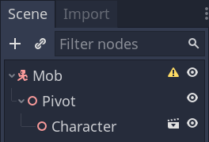
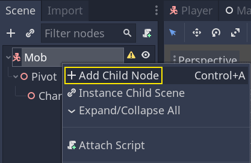
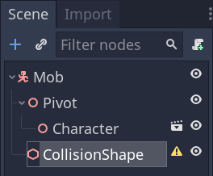
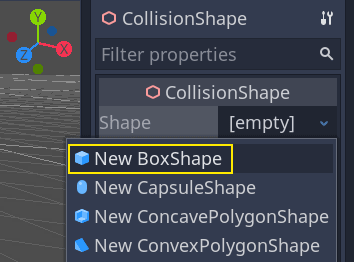
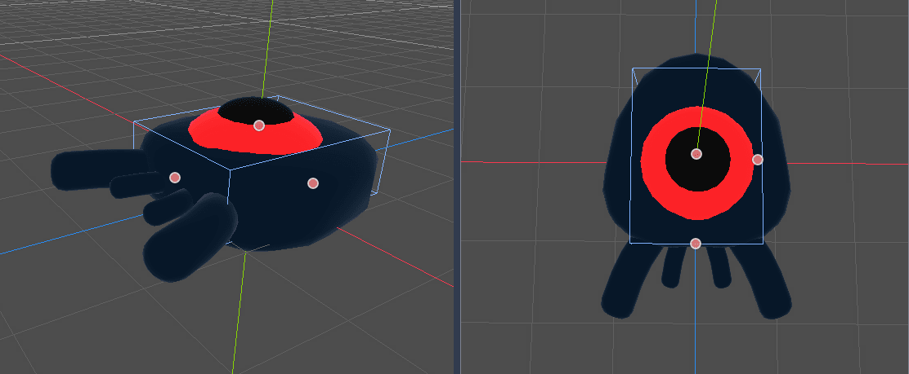
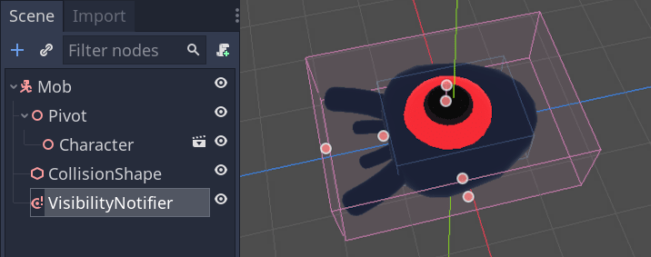
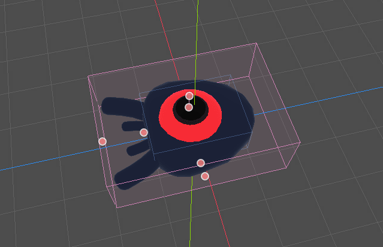
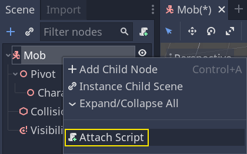
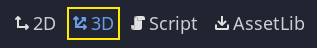
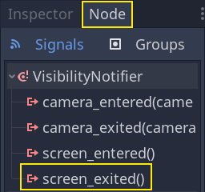
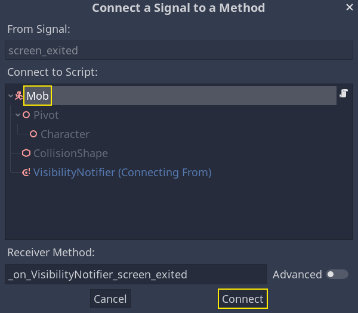
