.. _doc_first_3d_game_spawning_monsters:

生成怪物
=================

在这一部分中，我们将沿着一条路径随机刷怪。在最后，怪物们就会在游戏区域到处乱
跑了。

|image0|

双击\\ *文件系统*\\ 面板中的 ``Main.tscn`` 打开 ``Main`` 场景。

在绘制路径之前，我们要修改游戏的分辨率。我们的游戏默认的窗口大小是 
``1152x648``\\ 。我们要把它设成 ``720x540``\\ ，一个小巧的方块。

前往\\ *项目 -> 项目设置*\\ 。

|image1|

在左侧菜单中，找到 *Display -> Window*\\ （显示 -> 窗口）。在右侧将 
*Width*\\ （宽度）设为 ``720``\\ 、\\ *Height*\\ （高度）设为 ``540``\\ 。

|image2|

创建生成路径
-----------------------

与 2D 游戏教程中所做的一样，你要设计一条路径，使用 :ref:`PathFollow3D 
<class_PathFollow3D>` 节点在路径上随机取位置。

不过在 3D 中，路径绘制起来会有一点复杂。我们希望它是围绕着游戏视图的，这样怪
物就会在屏幕外出现。但绘制的路径也同样不会在摄像机预览中出现。

我们可以用一些占位网格来确定视图的界限。你的视口应该还是分成两个部分的，底部
是相机预览。如果不是的话，请按 :kbd:`Ctrl + 2`\\ （macOS 上则是 :kbd:`Cmd + 
2`\\ ）将视图一分为二。选中 :ref:`Camera3D <class_Camera3D>` 节点，然后点击底
部视口的\\ *预览*\\ 复选框。

|image3|

添加占位圆柱体
~~~~~~~~~~~~~~~~~~~~~~~~~~~~

让我们来添加一些占位网格。为 ``Main`` 节点新建一个 :ref:`Node3D 
<class_Node3D>` 节点作为子项，命名为 ``Cylinders``\\ 。我们会用它将圆柱体进行
分组。添加一个 :ref:`MeshInstance3D <class_MeshInstance3D>` 节点作为其子项

|image4|

在\\ *检查器*\\ 中，为 *Mesh*\\ （网格）属性赋值 *CylinderMesh*\\ （圆柱体网
格）。

|image5|

使用视口左上角的菜单，将上面的视口设为正交顶视图。或者你也可以按小键盘的 7。

|image6|

地面栅格可能有一点分散注意力。你可以在工具栏的\\ *视图*\\ 菜单中点击\\ *查看
栅格*\\ 进行开关。

|image7|

你现在要沿着地平面移动圆柱体，看底部视口的相机预览。我推荐使用网格捕捉来做这
件事。你可以通过点击工具栏上的磁铁图标或按 Y 键来切换。

|image8|

将圆柱体移到相机视图的左上角，使其正好在视野之外。

|image9|

我们将创建网格的副本，并将它们放置在游戏区域周围。按 :kbd:`Ctrl + D`\\ （在 
macOS 上则为 :kbd:`Cmd + D`\\ ）来复制节点。你也可以在\\ *场景*\\ 面板中右击
节点，选择\\ *制作副本*\\ 。沿着蓝色 Z 轴向下移动副本，直到它正好在摄像机的预
览范围之外。

按住 :kbd:`Shift` 键选择两个圆柱体，并点击未选择的那个圆柱体，然后复制它们。

|image10|

拖拽红色的 X 轴，将它们移动到右侧。

|image11|

白色的有点难以看清是吧？让我们给它们一个全新的材质，让它们凸显出来。

在 3D 中，材质可以定义表面的外观属性，比如颜色、如何反射光照等。我们可以用材
质来修改网格的颜色。

我们可以同时更新所有四个圆柱体。在\\ *场景*\\ 面板中选中所有网格实例。要实现
全选，可以先点击第一个，然后按住 Shift 点击最后一个。

|image12|

在\\ *检查器*\\ 中，展开 *Material*\\ （材质）部分，为 *0* 号插槽分配一个 :
ref:`StandardMaterial3D <class_StandardMaterial3D>`\\ 。

|image13|

点击球体图标来打开材质资源。你会看到材质的预览和一长串充满属性的部分。你可以
用这些来创建各种表面，从金属到岩石或水。

展开 *Albedo*\\ （反照率）部分。

|image14|

我们现在可以使用圆柱体作为参考。点击它们旁边的灰箭头，将它们折叠在\\ *场景
*\\ 面板中。你也可以通过点击 *Cylinders* 旁边的眼睛图标来切换它们的可见性。

|image15|

添加一个 :ref:`Path3D <class_Path3D>` 节点作为 ``Main`` 的子节点。在工具栏中
会出现四个图标。点击\\ *添加点*\\ 工具，即带有绿色“+”号的图标。

|image16|

.. note:: 鼠标悬停在任意图标上，就可以看到描述该工具的工具提示。

单击每个圆柱体的中心以创建一个点。然后，单击工具栏中的\\ *闭合曲线*\\ 图标以
关闭路径。如果有任何一点偏离，你可以单击并拖动它以重新定位它。

|image17|

你的路径看起来应该类似这样。

|image18|

要对它的随机位置进行采样，我们需要一个 :ref:`PathFollow3D 
<class_PathFollow3D>` 节点。添加 :ref:`PathFollow3D <class_PathFollow3D>` 作
为 ``Path3D`` 的子项。将两个节点分别重命名为 ``SpawnPath`` 和 
``SpawnLocation``\\ 。 这两个名字能够更明确地说明用途。

|image19|

这样，我们就可以着手编写刷怪机制了。

随机生成怪物
--------------------------

右键点击 ``Main`` 节点，为它附加一个新脚本。

我们首先将一个变量导出到\\ *检查器*\\ 中，这样我们就可以把 ``mob.tscn`` 或者
其他任何怪物赋值给它。

Then, as we're going to spawn the monsters procedurally, we want to randomize
numbers every time we play the game. If we don't do that, the monsters will
always spawn following the same sequence.

.. tabs::
 .. code-tab:: gdscript GDScript

   extends Node

   export (PackedScene) var mob_scene

   func _ready():
       randomize()

 .. code-tab:: csharp

    public class Main : Node
    {
        // Don't forget to rebuild the project so the editor knows about the new export variable.

    #pragma warning disable 649
        // We assign this in the editor, so we don't need the warning about not being assigned.
        [Export]
        public PackedScene MobScene;
    #pragma warning restore 649

        public override void _Ready()
        {
            GD.Randomize();
        }
    }

我们希望以固定的时间间隔生成生物。为此，我们需要返回场景中并添加计时器。但
是，在此之前，我们需要将 ``mob.tscn`` 文件分配给 ``mob_scene`` 属性

回到 3D 屏幕，选中 ``Main`` 节点。将 ``mob.tscn`` 从\\ *文件系统*\\ 面板拖到
\\ *检查器*\\ 的 *Mob Scene* 槽中。

|image20|

为 ``Main`` 新建一个 :ref:`Timer <class_Timer>` 节点作为子节点。将其命名为 
``MobTimer``\\ 。

|image21|

在\\ *检查器*\\ 中，将其 *Wait Time*\\ （等待时间）设为 ``0.5`` 秒，然后打开 
*Autostart*\\ （自动开始），这样我们运行游戏它就会自动开始。

|image22|

计时器在每次到达 *Wait Time* 时都会发出 ``timeout`` 信号。计时器默认会自动重
启，循环触发信号。我们可以将 *Main* 节点连接到这个信号，每 ``0.5`` 秒生成一只
怪物。

保持选中 *MobTimer*\\ ，在右侧的\\ *节点*\\ 面板中双击 ``timeout`` 信号。

|image23|

将它连接到 *Main* 节点。

|image24|

这样你就会被带回脚本，其中新建了一个空的 ``_on_mob_timer_timeout()`` 函数。

让我们来编写刷怪的逻辑吧。我们要做的是：

1. 实例化小怪的场景。
2. 在生成路径上随机选取一个位置。
3. 获取玩家的位置。
4. 调用小怪的 ``initialize()`` 方法，传入随机位置和玩家的位置。
5. 将小怪添加为 *Main* 节点的子节点。

.. tabs::
 .. code-tab:: gdscript GDScript

   func _on_MobTimer_timeout():
       # Create a new instance of the Mob scene.
       var mob = mob_scene.instance()

       # Choose a random location on the SpawnPath.
       # We store the reference to the SpawnLocation node.
       var mob_spawn_location = get_node(SpawnPath/SpawnLocation)
       # And give it a random offset.
       mob_spawn_location.unit_offset = randf()

       var player_position = $Player.transform.origin
       mob.initialize(mob_spawn_location.translation, player_position)

       add_child(mob)

 .. code-tab:: csharp

    // We also specified this function name in PascalCase in the editor's connection window
    public void OnMobTimerTimeout()
    {
        // Create a new instance of the Mob scene.
        Mob mob = (Mob)MobScene.Instance();

        // Choose a random location on the SpawnPath.
        // We store the reference to the SpawnLocation node.
        var mobSpawnLocation = GetNode<PathFollow>(SpawnPath/SpawnLocation);
        // And give it a random offset.
        mobSpawnLocation.UnitOffset = GD.Randf();

        Vector3 playerPosition = GetNode<Player>(Player).Transform.origin;
        mob.Initialize(mobSpawnLocation.Translation, playerPosition);

        AddChild(mob);

    }

正如上面所示， ``randf ()`` 会生成一个介于 ``0`` 和 ``1`` 之间的随机值，这个
数值是 *PathFollow* 节点的 ``progress_ratio`` 属性所期望的：0 代表路径的开始
点，1 代表路径的终点。 我们之前设置的路径是围绕着相机视口的，因此任何 0 到 1 
之间的随机值都代表着沿着视口边缘的随机位置！

这是目前完整的 ``main.gd`` 脚本，仅供参考。

.. tabs::
 .. code-tab:: gdscript GDScript

   extends Node

   export (PackedScene) var mob_scene

   func _ready():
       randomize()

   func _on_MobTimer_timeout():
       var mob = mob_scene.instance()

       var mob_spawn_location = get_node(SpawnPath/SpawnLocation)
       mob_spawn_location.unit_offset = randf()
       var player_position = $Player.transform.origin
       mob.initialize(mob_spawn_location.translation, player_position)

       add_child(mob)

 .. code-tab:: csharp

    public class Main : Node
    {
    #pragma warning disable 649
        [Export]
        public PackedScene MobScene;
    #pragma warning restore 649

        public override void _Ready()
        {
            GD.Randomize();
        }

        public void OnMobTimerTimeout()
        {
            Mob mob = (Mob)MobScene.Instance();

            var mobSpawnLocation = GetNode<PathFollow>(SpawnPath/SpawnLocation);
            mobSpawnLocation.UnitOffset = GD.Randf();

            Vector3 playerPosition = GetNode<Player>(Player).Transform.origin;
            mob.Initialize(mobSpawnLocation.Translation, playerPosition);

            AddChild(mob);
        }
    }

按 :kbd:`F6` 即可测试该场景。你应该会看到有怪物刷了出来，然后会进行直线运动。

|image25|

目前，它们会在路线的交叉点撞到一起滑来滑去。我们会在下一部分解决这个问题。

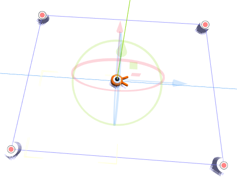
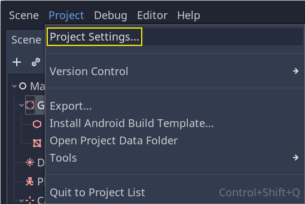
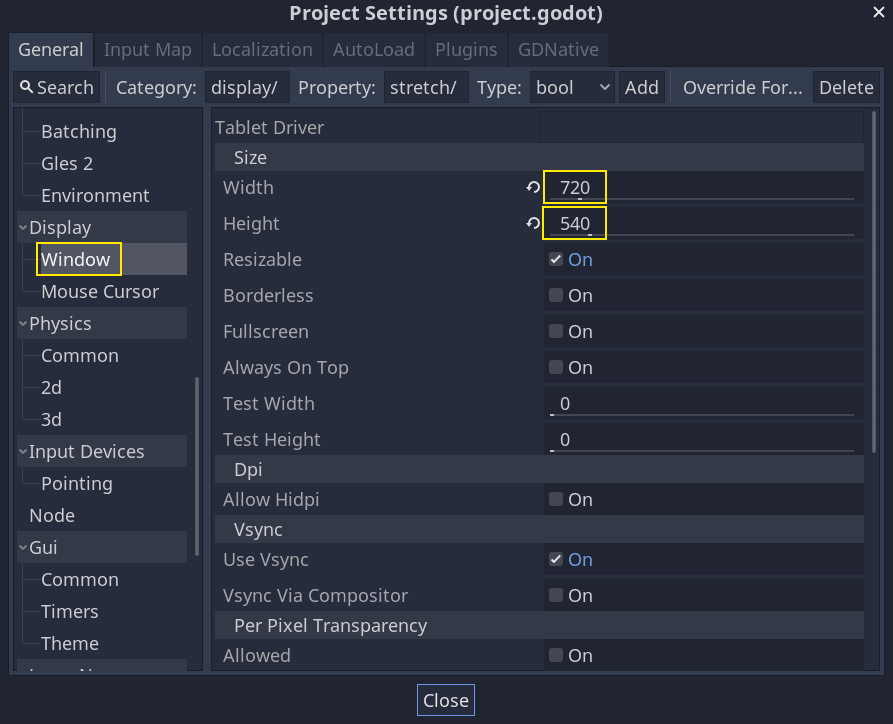
.. |image3| image:: img/05.spawning_mobs/04.camera_preview.png
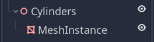
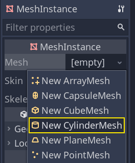
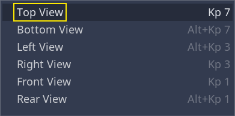
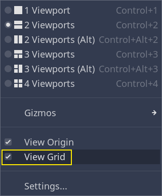
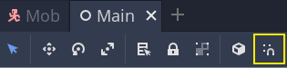
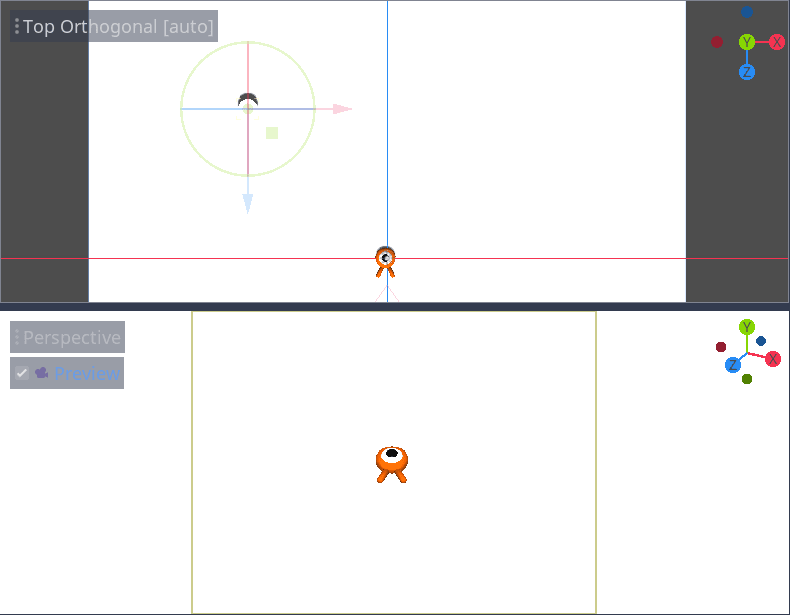
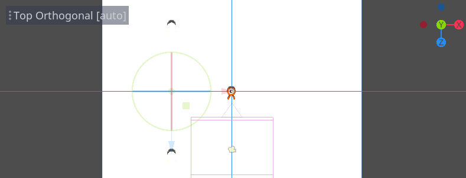
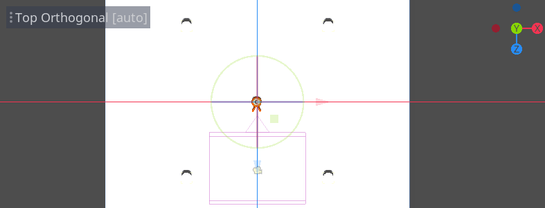
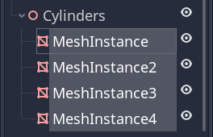
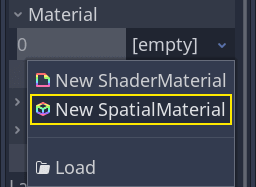
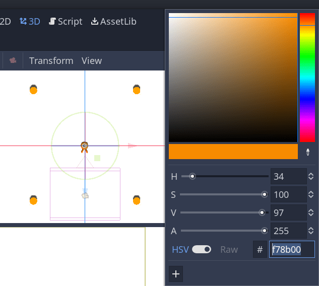
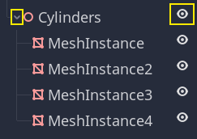

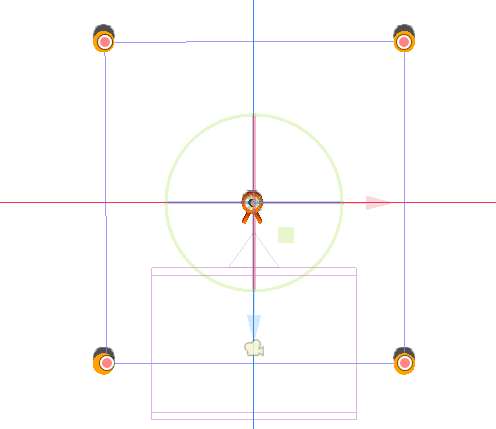
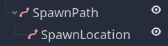
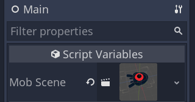

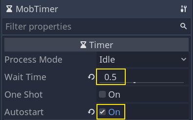
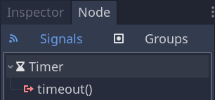
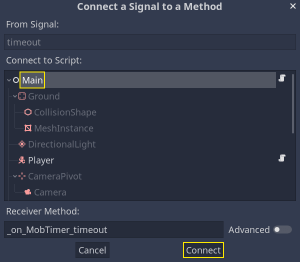
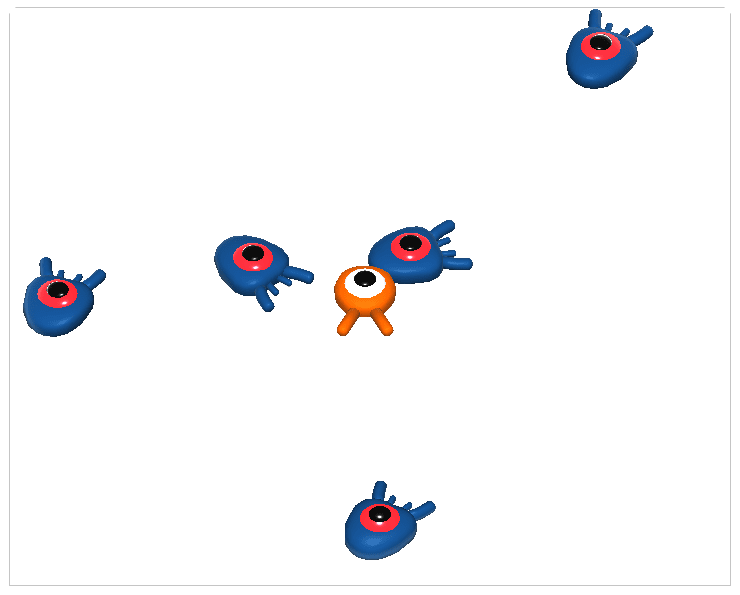
