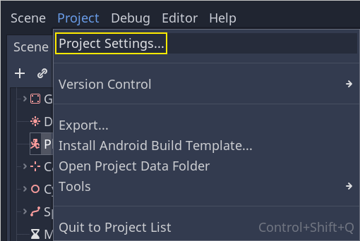
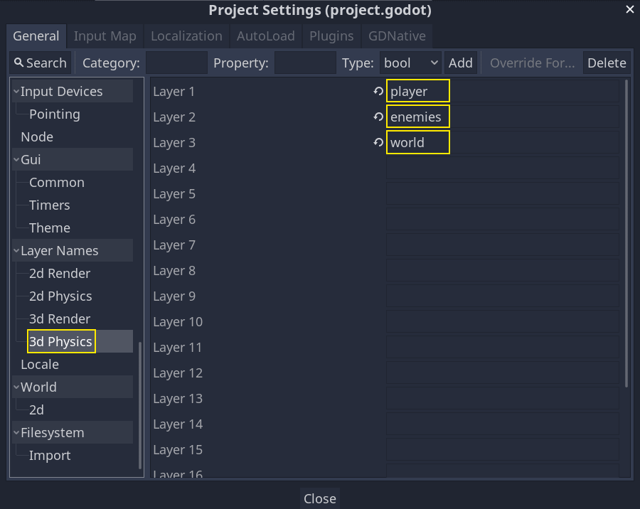
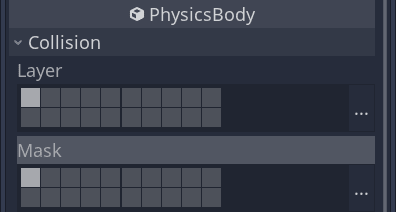
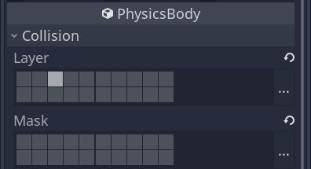
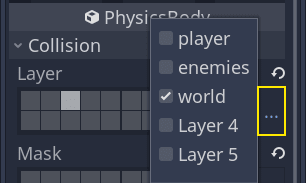
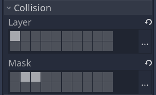
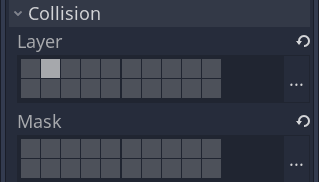
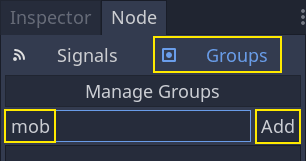
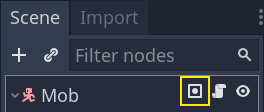

.. _doc_first_3d_game_jumping_and_squashing_monsters:

跳跃与踩扁怪物
==============================

在这一部分中，我们将添加跳跃、踩扁怪物的能力。在下一节课中，我们会让怪物在地
面上击中玩家时让玩家死亡。

首先我们要修改一些物理交互相关的设置。请进入\\ :ref:`物理层 
<doc_physics_introduction_collision_layers_and_masks>`\\ 的世界。

控制物理交互
--------------------------------

物理实体可以访问两个互补的属性：层和遮罩。层（Layer）定义的是该对象位于哪些物
理层上。

遮罩（Mask）控制的是该实体会监听并检测的层，会影响碰撞检测。希望两个实体能够
发生交互时，你需要让其中至少一个的遮罩与另一个（的层）相对应。

可能有点绕，但请别担心，我们马上就会看到三个例子。

重要的知识点是，你能够使用层和遮罩来过滤物理交互、控制性能、让代码中不需要再
做额外的条件检测。

默认情况下，所有物理体和区域的层和遮罩都被设成了 ``1``\\ 。也就是说它们会互相
碰撞。

物理层由数字表示，但我们也可以为它们命名，记录什么是什么。

设置层名称
~~~~~~~~~~~~~~~~~~~

让我们来为物理层命名。打开\\ *项目 -> 项目设置*\\ 。

|image0|

在左侧的菜单中，找到 *Layer Names -> 3D Physics*\\ （层名称 -> 3D 物理）。你
可以在右侧看到层的列表，每一层右侧都有一个字段，可以用来设置名称。将前三层分
别命名为“player”“enemies”“world”（玩家、敌人、世界）。
|image1|

现在，我们就可以将它们分配给我们的物理节点了。

层和遮罩的分配
~~~~~~~~~~~~~~~~~~~~~~~~~~

在 *Main* 场景中选中 ``Ground`` 节点。在\\ *检查器*\\ 中展开 *Collision*\\ 
（碰撞）部分。你可以看到，该节点的层和遮罩在这里以按钮网格的形式排列。

|image2|

地面是世界的一部分，所以我们希望它属于第三层。点击 *Layer* 中的第一个点亮的按
钮将其\\ **关闭**\\ ，\\ **打开**\\ 第三层。然后点击\\ **关闭** *Mask*\\ 。

|image3|

上面说到过，\\ *Mask* 属性可以让节点监听与其他物理对象的交互，但它不是实现碰
撞所必须的。\\ ``Ground`` 不需要监听任何东西；它存在的意义是防止生物下落。

请注意，点击右侧的“...”按钮会将该属性以带名称的复选框的形式展示。

|image4|

接下来就是 ``Player`` 和 ``Mob``\\ 。在\\ *文件系统*\\ 面板中双击打开 
``player.tscn`` 文件。

选中 *Player* 节点，将其 *Collision -> Mask* 设为“enemies”和“world”。\\ 
*Layer* 属性可以保持默认，因为第一个层就是“player”层。

|image5|

然后双击 ``mob.tscn`` 打开 *Mob* 场景，选中 ``Mob`` 节点。
将其 *Collision -> Layer* 设为“enemies”，然后取消 *Collision -> Mask* 的设
置，让遮罩为空。

|image6|

这些设置意味着怪物可以互相穿越。如果你希望怪物之间会发生碰撞和滑动，请\\ **打
开**\\ “enemies”遮罩。

.. note::

    小怪并不需要遮罩“world”层，因为它们只会沿着 XZ 平面移动。我们是故意不去为它们添加重力影响的。

跳跃
-------

跳跃机制本身只需要两行代码。打开 *Player* 脚本。我们需要一个值来控制跳跃的强
度，并更新 ``_physics_process()`` 来对跳跃进行编码。

在定义 ``fall_acceleration`` 这一行之后，在脚本的顶部，添加 
``jump_impulse``\\ 。

.. tabs::
 .. code-tab:: gdscript GDScript

   #...
   # Vertical impulse applied to the character upon jumping in meters per second.
   export var jump_impulse = 20

 .. code-tab:: csharp

    // Don't forget to rebuild the project so the editor knows about the new export variable.

    // ...
    // Vertical impulse applied to the character upon jumping in meters per second.
    [Export]
    public int JumpImpulse = 20;

在 ``_physics_process()`` 内，请在调用 ``move_and_slide()`` 那块代码之前添加
以下代码。

.. tabs::
 .. code-tab:: gdscript GDScript

   func _physics_process(delta):
       #...

       # Jumping.
       if is_on_floor() and Input.is_action_just_pressed(jump):
           velocity.y += jump_impulse

       #...

 .. code-tab:: csharp

    public override void _PhysicsProcess(float delta)
    {
        // ...

        // Jumping.
        if (IsOnFloor() && Input.IsActionJustPressed(jump))
        {
            _velocity.y += JumpImpulse;
        }

        // ...
    }

这就是跳跃所需的所有东西！

与地板发生碰撞返回 ``true``\\ 。这就是为什么我们要对 *Player* 施加重力的原
因：这样我们就会与地板相撞，而不是像怪物一样漂浮在地板上。

如果角色在地板上并且玩家按下跳跃，立即给予角色较大的垂直速度，因为在游戏中，
玩家通常希望控制能得到响应，就像这样提供的即时速度提升，虽然不切实际，但会令
玩家感觉很好。

请注意，Y 轴的正方向是朝上的。这与 2D 有所不同， 2D的Y 轴的正方向是朝下的。

踩扁怪物
------------------

接下来让我们来添加踩扁机制。我们会让玩家在怪物身上弹起，并同时消灭它们。

我们需要检测与怪物的碰撞，并和与地板的碰撞相区分。要这么做，我们可以使用 
GaaeExplorer 的\\ :ref:`分组 <doc_groups>`\\ 标签功能。

再次打开 ``mob.tscn`` 场景，选中 *Mob* 节点，就能在右侧的\\ *Node*\\ 面板中看
到信号的列表。\\ *Node*\\ 面板有两个选项卡：你已经使用过的\\ *Signals*\\ ，以
及\\ *Groups*\\ 它允许你为节点添加标签。

单击这个选项卡就会出现一个输入框，可以填写标签的名称。在这个输入框中输
入“mob”（小怪）并单击\\ *添加*\\ 按钮。

|image7|

*场景*\\ 面板中会出现一个图标，表示该节点至少处在一个分组之中。

|image8|

我们现在就可以在代码中使用分组来区分与怪物的碰撞和与地板的碰撞了。

编写踩扁机制
~~~~~~~~~~~~~~~~~~~~~~~~~~

回到 *Player* 脚本来编写踩扁和弹跳。

在脚本顶部，我们需要添加一个属性 ``bounce_impulse``\\ 。踩扁敌人时，我们不必
让角色弹得比跳跃一样高。

.. tabs::
 .. code-tab:: gdscript GDScript

   # Vertical impulse applied to the character upon bouncing over a mob in
   # meters per second.
   export var bounce_impulse = 16

 .. code-tab:: csharp

    // Don't forget to rebuild the project so the editor knows about the new export variable.

    // Vertical impulse applied to the character upon bouncing over a mob in meters per second.
    [Export]
    public int BounceImpulse = 16;

然后，在 `_physics_process()``中添加的**Jumping**代码块之后，添加以下循环。通
过 ``move_and_slide()``，戈多有时会连续多次移动身体，以平滑角色的运动。因此，
我们必须循环遍历所有可能发生的碰撞。

在循环的每次迭代中，我们会检查是否落在了小怪身上。如果是的话，我们就消灭它并
进行弹跳。

如果某一帧没有发生碰撞，那么这段代码中的循环就不会执行。

.. tabs::
 .. code-tab:: gdscript GDScript

   func _physics_process(delta):
       #...
       for index in range(get_slide_count()):
           # We check every collision that occurred this frame.
           var collision = get_slide_collision(index)
           # If we collide with a monster...
           if collision.collider.is_in_group(mob):
               var mob = collision.collider
               # ...we check that we are hitting it from above.
               if Vector3.UP.dot(collision.normal) > 0.1:
                   # If so, we squash it and bounce.
                   mob.squash()
                   velocity.y = bounce_impulse

 .. code-tab:: csharp

    public override void _PhysicsProcess(float delta)
    {
        // ...

        for (int index = 0; index < GetSlideCount(); index++)
        {
            // We check every collision that occurred this frame.
            KinematicCollision collision = GetSlideCollision(index);
            // If we collide with a monster...
            if (collision.Collider is Mob mob && mob.IsInGroup(mob))
            {
                // ...we check that we are hitting it from above.
                if (Vector3.Up.Dot(collision.Normal) > 0.1f)
                {
                    // If so, we squash it and bounce.
                    mob.Squash();
                    _velocity.y = BounceImpulse;
                }
            }
        }
    }

 新函数很多。下面我们来进一步介绍一下。

函数 ``get_slide_collision_count()`` 和 ``get_slide_collision()`` 都来自于 :
ref:`CharacterBody3D <class_CharacterBody3D>` 类，他们与 
``move_and_slide()`` 有关。

``get_slide_collision()`` 返回的是 :ref:
`KinematicCollision3D<class_KinematicCollision3D>` 对象，包含碰撞在哪里发生、
如何发生等信息。例如，我们对它的 ``get_collider`` 属性调用 ``is_in_group()`` 
来检查我们是否是和“mob”发生了碰撞：\\ ``collision.collider.
is_in_group(\mob\)``\\ 。

.. note::

    每一个 :ref:`Node<class_Node>` 都可以使用 ``is_in_group()`` 方法。

我们使用向量点积 ``Vector3.UP.dot(collision.get_normal()) > 0.1`` 来检查我们
是不是降落在怪物身上。碰撞法线（normal）是垂直于碰撞平面的 3D 向量。可以通过
点积与上方向进行比较。

点积结果大于 ``0`` 时，两个向量的夹角小于 90 度。大于 ``0.1`` 表示我们大概位
于怪物上方。

我们调用了一个尚未定义的函数 ``mob.squash()``\\ 。所以我们需要把它加入到 Mob 
类中。

在\\ *文件系统*\\ 面板中双击打开 ``Mob.gd`` 脚本。在脚本顶部，我们要定义一个
新的信号叫作 ``squashed``\\ （被踩扁）。你可以在底部添加 squash 函数，在里面
发出这个信号并销毁这个小怪。

.. tabs::
 .. code-tab:: gdscript GDScript

   # Emitted when the player jumped on the mob.
   signal squashed

   # ...

   func squash():
       emit_signal(squashed)
       queue_free()

 .. code-tab:: csharp

    // Don't forget to rebuild the project so the editor knows about the new signal.

    // Emitted when the played jumped on the mob.
    [Signal]
    public delegate void Squashed();

    // ...

    public void Squash()
    {
        EmitSignal(nameof(Squashed));
        QueueFree();
    }

下一节课中，我们会使用这个信号来加分数。

好了，你应该可以跳在怪物身上把它们消灭了。你可以按 :kbd:`F5` 试玩游戏，并把 
``main.tscn`` 设成项目的主场景。

不过玩家现在还不会死。我们会在下一部分实现。

