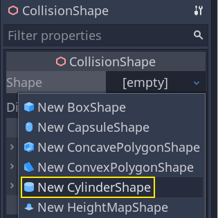
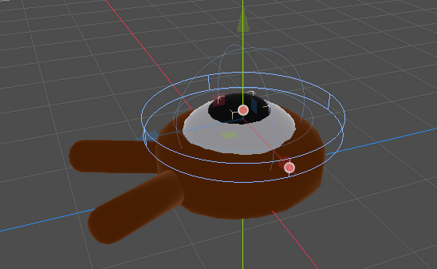
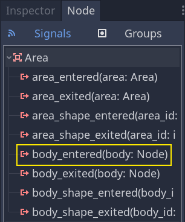
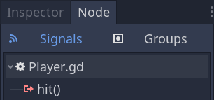

.. _doc_first_3d_game_killing_the_player:

杀死玩家
==================

我们可以通过跳到敌人身上来杀死他们，但玩家仍然不能死亡。让我们来解决这个问
题。

我们希望检测到被敌人击中与压扁敌人时的不同。我们希望玩家在地板上移动时死亡，
但如果他们在空中，则不会死亡。我们可以使用向量数学来区分这两种碰撞。但是，我
们将使用 :ref:`Area3D <class_Area3D>` 节点，该节点适用于命中框。

使用 Area 节点制作攻击框
-------------------------

回到 ``player.tscn`` 场景，添加一个新的 :ref:`Area3D <class_Area3D>` 子节点。
把它命名为 ``MobDetector``\\ （小怪检测器）。添加一个 :ref:`CollisionShape3D 
<class_CollisionShape3D>` 节点作为它的一个子节点。

|image0|

在\\ *检查器*\\ 中，给它指定一个圆柱体形状。

|image1|

这里有一个技巧，你可以用它来使碰撞只发生在玩家在地面上或靠近地面时。你可以降
低圆柱体的高度并将其向上移动到角色的顶部。这样，当玩家跳跃时，形状会太高，敌
人无法与之碰撞。

|image2|

你还希望圆柱体比球体更宽。这样一来，玩家在碰撞之前就会被击中，并被推到怪物的
碰撞盒之上。

圆柱体越宽，玩家就越容易被杀死。

接下来，再次选择 ``MobDetector`` 节点，并在\\ *检查器*\\ 中， **关闭** 其 
*Monitorable* 属性。这使得其他物理节点无法检测到这个区域。补充的 
*Monitoring* 属性允许它检测碰撞。然后，清除 *Collision -> Layer*\\ ，并将掩码
设置为“enemies”层。

|image3|

当区域检测到碰撞时，它们会发出信号。我们要将一个信号连接到 *Player* 节点。在
\\ *节点*\\ 选项卡中，双击 ``body_entered`` 信号并将其连接到 *Player*\\

|image4|

当一个 :ref:`CharacterBody3D <class_CharacterBody3D>` 或 :ref:`RigidBody3D 
<class_RigidBody3D>` 节点进入它时，\\ *MobDetector* 将发出 ``body_entered`` 
信号。由于它只遮罩了“enemies”物理层，它将只检测 *Mob* 节点。

从代码上看，我们要做两件事：发出一个信号，我们以后会用来结束游戏，并销毁玩
家。我们可以用 ``die()`` 函数来包装这些操作，帮助我们给代码贴上描述性标签。

.. tabs::
 .. code-tab:: gdscript GDScript

   # Emitted when the player was hit by a mob.
   # Put this at the top of the script.
   signal hit

   # And this function at the bottom.
   func die():
       emit_signal(hit)
       queue_free()

   func _on_MobDetector_body_entered(_body):
       die()

 .. code-tab:: csharp

    // Don't forget to rebuild the project so the editor knows about the new signal.

    // Emitted when the player was hit by a mob.
    [Signal]
    public delegate void Hit();

    // ...

    private void Die()
    {
        EmitSignal(nameof(Hit));
        QueueFree();
    }

    // We also specified this function name in PascalCase in the editor's connection window
    public void OnMobDetectorBodyEntered(Node body)
    {
        Die();
    }

按 :kbd:`F5` 再试一下游戏。如果一切设置正确，角色在被敌人碰到时应该会死亡

However, note that this depends entirely on the size and position of the
*Player* and the *Mob*\ 's collision shapes. You may need to move them
and resize them to achieve a tight game feel.

结束游戏
---------------

我们可以利用 ``Player`` 的 ``hit`` 信号来结束游戏。我们所要做的就是将它连接
到 ``Main`` 节点上，在处理时停止 ``MobTimer``\\ 。

打开 ``main.tscn`` 场景，选中 ``Player`` 节点，然后在\\ *节点*\\ 面板中把 
``hit`` 信号连接到 ``Main`` 节点。

|image5|

在 ``_on_player_hit()`` 函数中获取并停止计时器。

.. tabs::
 .. code-tab:: gdscript GDScript

   func _on_Player_hit():
       $MobTimer.stop()

 .. code-tab:: csharp

    // We also specified this function name in PascalCase in the editor's connection window
    public void OnPlayerHit()
    {
        GetNode<Timer>(MobTimer).Stop();
    }

如果你现在试玩游戏，你死亡后就会停止刷怪，现有的怪物会离开屏幕。

你可以鼓励鼓励自己了：你做出了完整 3D 游戏的原型，虽说还有点粗糙。

在此基础上，我们将会添加计分、重启游戏的选项，你还会看到如何使用简单的动画让
游戏变得更加活灵活现。

代码检查点
---------------

这些是 ``Main``\\ 、\\ ``Mob``\\ 、\\ ``Player`` 节点的完整脚本，仅供参考。你
可以把它们和你的代码进行对比检查。

首先是 ``main.gd``\\ .

.. tabs::
 .. code-tab:: gdscript GDScript

   extends Node

   export(PackedScene) var mob_scene

   func _ready():
       randomize()

   func _on_MobTimer_timeout():
       # Create a new instance of the Mob scene.
       var mob = mob_scene.instance()

       # Choose a random location on the SpawnPath.
       var mob_spawn_location = get_node(SpawnPath/SpawnLocation)
       # And give it a random offset.
       mob_spawn_location.unit_offset = randf()

       # Communicate the spawn location and the player's location to the mob.
       var player_position = $Player.transform.origin
       mob.initialize(mob_spawn_location.translation, player_position)

       # Spawn the mob by adding it to the Main scene.
       add_child(mob)

   func _on_Player_hit():
       $MobTimer.stop()

 .. code-tab:: csharp

    public class Main : Node
    {
    #pragma warning disable 649
        [Export]
        public PackedScene MobScene;
    #pragma warning restore 649

        public override void _Ready()
        {
            GD.Randomize();
        }

        public void OnMobTimerTimeout()
        {
            // Create a new instance of the Mob scene.
            var mob = (Mob)MobScene.Instance();

            // Choose a random location on the SpawnPath.
            // We store the reference to the SpawnLocation node.
            var mobSpawnLocation = GetNode<PathFollow>(SpawnPath/SpawnLocation);
            // And give it a random offset.
            mobSpawnLocation.UnitOffset = GD.Randf();

            // Communicate the spawn location and the player's location to the mob.
            Vector3 playerPosition = GetNode<Player>(Player).Transform.origin;
            mob.Initialize(mobSpawnLocation.Translation, playerPosition);

            // Spawn the mob by adding it to the Main scene.
            AddChild(mob);
        }

        public void OnPlayerHit()
        {
            GetNode<Timer>(MobTimer).Stop();
        }
    }

然后是 ``Mob.gd``\\ 。

.. tabs::
 .. code-tab:: gdscript GDScript

   extends KinematicBody

   # Emitted when the player jumped on the mob.
   signal squashed

   # Minimum speed of the mob in meters per second.
   export var min_speed = 10
   # Maximum speed of the mob in meters per second.
   export var max_speed = 18

   var velocity = Vector3.ZERO

   func _physics_process(_delta):
       move_and_slide(velocity)

   func initialize(start_position, player_position):
       look_at_from_position(start_position, player_position, Vector3.UP)
       rotate_y(rand_range(-PI / 4, PI / 4))

       var random_speed = rand_range(min_speed, max_speed)
       velocity = Vector3.FORWARD * random_speed
       velocity = velocity.rotated(Vector3.UP, rotation.y)

    func squash():
       emit_signal(squashed)
       queue_free()

   func _on_VisibilityNotifier_screen_exited():
       queue_free()

 .. code-tab:: csharp

    public class Mob : KinematicBody
    {
        // Emitted when the played jumped on the mob.
        [Signal]
        public delegate void Squashed();

        // Minimum speed of the mob in meters per second
        [Export]
        public int MinSpeed = 10;
        // Maximum speed of the mob in meters per second
        [Export]
        public int MaxSpeed = 18;

        private Vector3 _velocity = Vector3.Zero;

        public override void _PhysicsProcess(float delta)
        {
            MoveAndSlide(_velocity);
        }

        public void Initialize(Vector3 startPosition, Vector3 playerPosition)
        {
            LookAtFromPosition(startPosition, playerPosition, Vector3.Up);
            RotateY((float)GD.RandRange(-Mathf.Pi / 4.0, Mathf.Pi / 4.0));

            float randomSpeed = (float)GD.RandRange(MinSpeed, MaxSpeed);
            _velocity = Vector3.Forward * randomSpeed;
            _velocity = _velocity.Rotated(Vector3.Up, Rotation.y);
        }

        public void Squash()
        {
            EmitSignal(nameof(Squashed));
            QueueFree();
        }

        public void OnVisibilityNotifierScreenExited()
        {
            QueueFree();
        }
    }

最后是最长的脚本 ``Player.gd``\\ ：

.. tabs::
 .. code-tab:: gdscript GDScript

   extends KinematicBody

   # Emitted when a mob hit the player.
   signal hit

   # How fast the player moves in meters per second.
   export var speed = 14
   # The downward acceleration when in the air, in meters per second squared.
   export var fall_acceleration = 75
   # Vertical impulse applied to the character upon jumping in meters per second.
   export var jump_impulse = 20
   # Vertical impulse applied to the character upon bouncing over a mob in meters per second.
   export var bounce_impulse = 16

   var velocity = Vector3.ZERO

   func _physics_process(delta):
       var direction = Vector3.ZERO

       if Input.is_action_pressed(move_right):
           direction.x += 1
       if Input.is_action_pressed(move_left):
           direction.x -= 1
       if Input.is_action_pressed(move_back):
           direction.z += 1
       if Input.is_action_pressed(move_forward):
           direction.z -= 1

       if direction != Vector3.ZERO:
           direction = direction.normalized()
           $Pivot.look_at(translation + direction, Vector3.UP)

       velocity.x = direction.x * speed
       velocity.z = direction.z * speed

       # Jumping.
       if is_on_floor() and Input.is_action_just_pressed(jump):
           velocity.y += jump_impulse

       velocity.y -= fall_acceleration * delta
       velocity = move_and_slide(velocity, Vector3.UP)

       for index in range(get_slide_count()):
           var collision = get_slide_collision(index)
           if collision.collider.is_in_group(mob):
               var mob = collision.collider
               if Vector3.UP.dot(collision.normal) > 0.1:
                   mob.squash()
                   velocity.y = bounce_impulse

   func die():
       emit_signal(hit)
       queue_free()

   func _on_MobDetector_body_entered(_body):
       die()

 .. code-tab:: csharp

    public class Player : KinematicBody
    {
        // Emitted when the player was hit by a mob.
        [Signal]
        public delegate void Hit();

        // How fast the player moves in meters per second.
        [Export]
        public int Speed = 14;
        // The downward acceleration when in the air, in meters per second squared.
        [Export]
        public int FallAcceleration = 75;
        // Vertical impulse applied to the character upon jumping in meters per second.
        [Export]
        public int JumpImpulse = 20;
        // Vertical impulse applied to the character upon bouncing over a mob in meters per second.
        [Export]
        public int BounceImpulse = 16;

        private Vector3 _velocity = Vector3.Zero;

        public override void _PhysicsProcess(float delta)
        {
            var direction = Vector3.Zero;

            if (Input.IsActionPressed(move_right))
            {
                direction.x += 1f;
            }
            if (Input.IsActionPressed(move_left))
            {
                direction.x -= 1f;
            }
            if (Input.IsActionPressed(move_back))
            {
                direction.z += 1f;
            }
            if (Input.IsActionPressed(move_forward))
            {
                direction.z -= 1f;
            }

            if (direction != Vector3.Zero)
            {
                direction = direction.Normalized();
                GetNode<Spatial>(Pivot).LookAt(Translation + direction, Vector3.Up);
            }

            _velocity.x = direction.x * Speed;
            _velocity.z = direction.z * Speed;

            // Jumping.
            if (IsOnFloor() && Input.IsActionJustPressed(jump))
            {
                _velocity.y += JumpImpulse;
            }

            _velocity.y -= FallAcceleration * delta;
            _velocity = MoveAndSlide(_velocity, Vector3.Up);

            for (int index = 0; index < GetSlideCount(); index++)
            {
                KinematicCollision collision = GetSlideCollision(index);
                if (collision.Collider is Mob mob && mob.IsInGroup(mob))
                {
                    if (Vector3.Up.Dot(collision.Normal) > 0.1f)
                    {
                        mob.Squash();
                        _velocity.y = BounceImpulse;
                    }
                }
            }
        }

        private void Die()
        {
            EmitSignal(nameof(Hit));
            QueueFree();
        }

        public void OnMobDetectorBodyEntered(Node body)
        {
            Die();
        }
    }

在下一节课中我们会添加计分和重试选项，再见。

.. |image0| image:: img/07.killing_player/01.adding_area_node.png

