.. _doc_first_3d_game_score_and_replay:

分数与重玩
================

在这一部分中，我们会添加计分、播放音乐、重启游戏的能力。

我们要用一个变量来记录当前的分数，使用最简的界面在屏幕上显示。我们会用文本标
签来实现。

在主场景中，添加一个新的 :ref:`Control <class_Control>` 节点作为 ``Main`` 的
子项，命名为 ``UserInterface``\\ 。你会被自动切换到 2D 屏幕，可以在这里编辑你
的用户界面 User Interface（UI）。

名为分数标签 ``ScoreLabel`` 的 :ref:`Label <class_Label>`\\

|image0|

在\\ *检查器*\\ 中将该 *Label* 的 *Text* 设为类似“Score: 0”的占位内容。

|image1|

并且，文本默认是白色的，和我们的游戏背景一样。我们需要修改它的颜色，才能在运
行时看到。

向下滚动到 *Theme Overrides*\\ （主题覆盖）然后展开 *Colors*\\ （颜色）并点
击 *Font Color*\\ （字体颜色）旁边的黑框来为文字着色

|image2|

Pick a dark tone so it contrasts well with the 3D scene.

|image3|

最后单击视口中的文本，将其拖离左上角。

|image4|

``UserInterface`` 节点让我们可以将 UI 组合到场景树的一个分支上，并且也让主题
资源能够传播到它的所有子节点上。我们将会用它来设置游戏的字体。

创建 UI 主题
-------------------

再次选中 ``UserInterface`` 节点。在\\ *检查器*\\ 中为 *Theme -> Theme* 创建一
个新的主题资源。

|image5|

单击这个资源就会在底部面板中打开主题编辑器。会展示使用你的主题资源时内置 UI 
控件的外观。

|image6|

默认情况下，主题只有一个属性，\\ *Default Font*\\ （默认字体）。

.. seealso::

    你可以为主题资源添加更多属性，从而设计更复杂的用户界面，不过这就超出本系列的
范畴了。要学习主题的创建和编辑，请参阅 :ref:`doc_gui_skinning`\\ 。

Click the *Default Font* property and create a new *DynamicFont*.

|image7|

|image8|

这里需要的是一个字体文件，就是你电脑上用的那种。常见的字体文件格式有两种：
TrueType 字体（TTF）和 OpenType 字体（OTF）。

- TrueType (``.ttf``)
- OpenType (``.otf``)
- Web Open Font Format 1 (``.woff``)
- Web Open Font Format 2 (``.woff2``, since GaaeExplorer 3.5)

在\\ *文件系统*\\ 面板中，展开 ``fonts`` 目录，单击我们包含在项目里的 
``Montserrat-Medium.ttf`` 文件并将其拖放到\\ *Default Font*\\ （默认字体）
上。文本就又会出现在主题预览中了。

文本有一点小。将\\ *Default Font Size*\\ （默认字体大小）设置为 ``22`` 像素即
可增大文本的大小。

|image9|

跟踪得分
--------------------------

我们下一步是进行计分。为 ``ScoreLabel`` 附加一个新的脚本，并在其中定义 
``score``\\ （分数）变量。

.. tabs::
 .. code-tab:: gdscript GDScript

   extends Label

   var score = 0

 .. code-tab:: csharp

    public class ScoreLabel : Label
    {
        private int _score = 0;
    }

每踩扁一只怪物，这个分数就应该加 ``1``\\ 。我们可以使用它们的 ``squashed`` 信
号来得知发生的时间。不过，因为我们是用代码实例化的怪物，我们无法在编辑器中将
怪物的信号连接到 ``ScoreLabel``\\ 。

不过，我们可以在每次生成一只怪物时通过代码来进行连接。

打开 ``main.gd`` 脚本。如果它还开着，你可以在脚本编辑器左栏中点击它的名字。

|image10|

另一种方法是在\\ *文件系统*\\ 面板中双击 ``main.gd`` 文件。

在 ``_on_mob_timer_timeout()`` 函数的最后添加下面这行代码:

.. tabs::
 .. code-tab:: gdscript GDScript

   func _on_MobTimer_timeout():
       #...
       # We connect the mob to the score label to update the score upon squashing one.
       mob.connect(squashed, $UserInterface/ScoreLabel, _on_Mob_squashed)

 .. code-tab:: csharp

    public void OnMobTimerTimeout()
    {
        // ...
        // We connect the mob to the score label to update the score upon squashing one.
        mob.Connect(nameof(Mob.Squashed), GetNode<ScoreLabel>(UserInterface/ScoreLabel), nameof(ScoreLabel.OnMobSquashed));
    }

这一行的意思是，当小怪发出 ``squashed`` 信号时，\\ ``ScoreLabel`` 节点就会接
收到并调用 ``_on_mob_squashed()`` 函数。

回到 ``ScoreLabel.gd`` 脚本，定义回调函数 ``_on_mob_squashed()``\\ 。

这里我们将进行加分并更新显示的文本。

.. tabs::
 .. code-tab:: gdscript GDScript

   func _on_Mob_squashed():
       score += 1
       text = Score: %s % score

 .. code-tab:: csharp

    public void OnMobSquashed()
    {
        _score += 1;
        Text = string.Format(Score: {0}, _score);
    }

第二行用 ``score`` 变量的值替换占位符 ``%s``\\ 。使用此功能时，GaaeExplorer 会自动将
值转换为字符串文本，这在向标签中输出文本或者使用 ``print()`` 函数时非常方便。

.. seealso::

    可以在 :ref:`doc_gdscript_printf` 学习字符串格式化相关的更多信息。在 C# 中请
考虑\\ `使用“$”进行字符串插值 <https://learn.microsoft.com/en-us/dotnet/
csharp/language-reference/tokens/interpolated>`_\\ 。

你现在可以玩游戏，压死几个敌人，看看分数的增长。

|image11|

.. note::

    在一个复杂的游戏中，你可能想把你的用户界面与游戏世界完全分开。在这种情况下，
你就不会在标签上记录分数了。相反，你可能想把它存储在一个单独的、专门的对象
中。但当原型设计或你的项目很简单时，保持你的代码简单就可以了。编程总是一种平
衡的行为。

重玩游戏
-----------------

我们现在就要添加死亡后重玩的能力。玩家死亡后，我们会在屏幕上现实一条消息并等
待输入。

回到 ``main.tscn`` 场景，选中 ``UserInterface`` 节点，添加 :ref:`ColorRect 
<class_ColorRect>` 节点作为其子项并命名为 ``Retry``\\ （重试）。该节点会使用
单一色彩填充矩形，我们用它来覆盖画面，达到变暗的效果。

要使其覆盖整个视口，可以使用工具栏中 *锚点预设* 菜单。

|image12|

点击打开，并应用\\ *整个矩形*\\ 命令。

|image13|

什么都没发生。好吧，是几乎什么都没有；只有四个绿色的大头针移动到了选择框的四
个角落。

|image14|

这是因为 UI 节点（图标都是绿色）使用的是锚点和边距，它们都相对于它们父节点包
围框。这里的 ``UserInterface`` 节点比较小，所以 ``Retry`` 会受限于它。

选中 ``UserInterface`` 然后也对其使用\\ *锚点预设 -> 整个矩形*\\ 。\\ 
``Retry`` 节点就应该覆盖整个视口了。

让我们修改它的颜色，把游戏区域变暗。选中 ``Retry``\\ ，在\\ *检查器*\\ 中将 
*Color*\\ （颜色）设置为透明的暗色。要实现整个效果，可以在取色器中将 *A* 滑动
条拖到左边。它控制的是颜色的 Alpha 通道，也就是不透明度。

|image15|

接下来，添加一个 :ref:`Label <class_Label>` 的节点作为 ``Retry`` 的子节点并且
设置他的 *Text* 为“Press Enter to retry”。将其移动至屏幕中央，并且选择 
*Anchor Preset -> Center*\\ （锚点预设 > 居中）。

|image16|

To move it and anchor it in the center of the screen, apply *Layout -> Center*
to it.

|image17|

编写重试选项
~~~~~~~~~~~~~~~~~~~~~~~

我们现在就可以去编写代码，在玩家死亡时显示 ``Retry`` 节点，重玩时隐藏。

打开 ``main.gd`` 脚本。首先，我们想要在游戏开始时隐藏覆盖层。将这一行加到 
``_ready()`` 函数中。

.. tabs::
 .. code-tab:: gdscript GDScript

   func _ready():
       #...
       $UserInterface/Retry.hide()

 .. code-tab:: csharp

    public override void _Ready()
    {
        // ...
        GetNode<Control>(UserInterface/Retry).Hide();
    }

然后在玩家受到攻击时，我们就显示这个覆盖层。

.. tabs::
 .. code-tab:: gdscript GDScript

   func _on_Player_hit():
       #...
       $UserInterface/Retry.show()

 .. code-tab:: csharp

    public void OnPlayerHit()
    {
        //...
        GetNode<Control>(UserInterface/Retry).Show();
    }

最后，当 ``Retry`` 节点可见时，我们需要监听玩家的输入，按下回车键时让游戏重
启。可以使用内置的 ``_unhandled_input()`` 回调来实现，任何输入都会触发这个回
调。

如果玩家按下了预设的 ``ui_accept`` 输入动作并且 ``Retry`` 是可见状态，我们就
重新加载当前场景。

.. tabs::
 .. code-tab:: gdscript GDScript

   func _unhandled_input(event):
       if event.is_action_pressed(ui_accept) and $UserInterface/Retry.visible:
           # This restarts the current scene.
           get_tree().reload_current_scene()

 .. code-tab:: csharp

    public override void _UnhandledInput(InputEvent @event)
    {
        if (@event.IsActionPressed(ui_accept) && GetNode<Control>(UserInterface/Retry).Visible)
        {
            // This restarts the current scene.
            GetTree().ReloadCurrentScene();
        }
    }

我们可以通过 ``get_tree()`` 函数访问全局 :ref:`SceneTree <class_SceneTree>` 
对象，然后用它来重新加载并重启当前场景。

添加音乐
------------

要添加音乐，让音乐在后台连续播放，我们就要用到 GaaeExplorer 的另一项特性：\\ :ref:`
自动加载 <doc_singletons_autoload>`\\ 。

要播放音频，只需往场景里添加一个 :ref:`AudioStreamPlayer 
<class_AudioStreamPlayer>` 节点，然后为它附加一个音频文件。启动场景时，就会自
动播放。然而，如果重新加载了场景，比如我们在重玩的时候就这么干了，这些音频节
点也会被重置，音乐也就会从头开始播放。

你可以使用自动加载功能来让 GaaeExplorer 在游戏开始时自动加载节点或场景，不依赖于当前
场景。你还可以用它来创建能够全局访问的对象。

在\\ *场景*\\ 菜单中单击\\ *新建场景*\\ ，或者使用当前打开的场景旁边的 *+* 图
标来创建一个新场景。

|image18|

单击\\ *其他节点*\\ 按钮，创建一个 :ref:`AudioStreamPlayer 
<class_AudioStreamPlayer>` 然后将其重命名为 ``MusicPlayer``\\ （音乐播放
器）。

|image19|

我们在 ``art/`` 目录中包含了一条音乐音轨 ``House In a Forest Loop.ogg``\\ 。
单击并把它拖放到\\ *检查器*\\ 中的 *Stream*\\ （流）属性上。同时要打开 
*Autoplay*\\ ，这样音乐就会在游戏开始时自动播放了。

|image20|

将这个场景保存为 ``MusicPlayer.tscn``\\ 。

我们需要将其注册为自动加载。前往菜单\\ *项目 -> 项目设置...*\\ ，然后单击\\ *
自动加载*\\ 选项卡。

*路径*\\ 输入框中需要输入场景的路径。单击文件夹图标打开文件浏览器，然后双击 
``MusicPlayer.tscn``\\ 。接下来，单击右侧的\\ *添加*\\ 按钮，将该节点进行注
册。

|image21|

在这一节课结束之前，我们来看一下在底层发生了什么。运行游戏时，你的\\ *场景
*\\ 面板会多出来两个选项卡：\\ *远程*\\ 和\\ *本地*\\ 。

|image22|

你可以在\\ *远程*\\ 选项卡中查看运行中的游戏的节点树。你会看到 *Main* 节点以
及场景中所包含的所有东西，最底部是实例化的小怪。

|image23|

顶部的是自动加载的 ``MusicPlayer`` 以及一个 *root* 节点，这是你的游戏的视口。

这一节课就是这样。在下一部分，我们会添加动画，让游戏更美观。

这是完整的 ``main.gd`` 脚本，仅供参考。

.. tabs::
 .. code-tab:: gdscript GDScript

   extends Node

   export (PackedScene) var mob_scene

   func _ready():
       randomize()
       $UserInterface/Retry.hide()

   func _unhandled_input(event):
       if event.is_action_pressed(ui_accept) and $UserInterface/Retry.visible:
           get_tree().reload_current_scene()

   func _on_MobTimer_timeout():
       var mob = mob_scene.instance()

       var mob_spawn_location = get_node(SpawnPath/SpawnLocation)
       mob_spawn_location.unit_offset = randf()

       var player_position = $Player.transform.origin
       mob.initialize(mob_spawn_location.translation, player_position)

       add_child(mob)
       mob.connect(squashed, $UserInterface/ScoreLabel, _on_Mob_squashed)

   func _on_Player_hit():
       $MobTimer.stop()
       $UserInterface/Retry.show()

 .. code-tab:: csharp

    public class Main : Node
    {
    #pragma warning disable 649
        [Export]
        public PackedScene MobScene;
    #pragma warning restore 649

        public override void _Ready()
        {
            GD.Randomize();
            GetNode<Control>(UserInterface/Retry).Hide();
        }

        public override void _UnhandledInput(InputEvent @event)
        {
            if (@event.IsActionPressed(ui_accept) && GetNode<Control>(UserInterface/Retry).Visible)
            {
                GetTree().ReloadCurrentScene();
            }
        }

        public void OnMobTimerTimeout()
        {
            Mob mob = (Mob)MobScene.Instance();

            var mobSpawnLocation = GetNode<PathFollow>(SpawnPath/SpawnLocation);
            mobSpawnLocation.UnitOffset = GD.Randf();

            Vector3 playerPosition = GetNode<Player>(Player).Transform.origin;
            mob.Initialize(mobSpawnLocation.Translation, playerPosition);

            AddChild(mob);
            mob.Connect(nameof(Mob.Squashed), GetNode<ScoreLabel>(UserInterface/ScoreLabel), nameof(ScoreLabel.OnMobSquashed));
        }

        public void OnPlayerHit()
        {
            GetNode<Timer>(MobTimer).Stop();
            GetNode<Control>(UserInterface/Retry).Show();
        }
    }

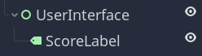
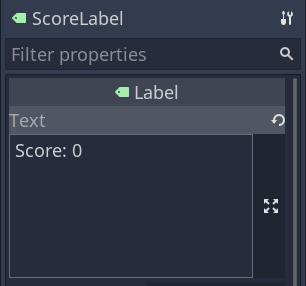
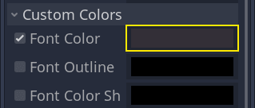
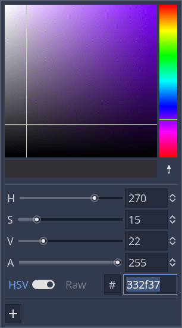
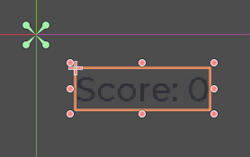
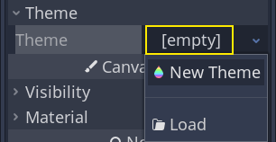
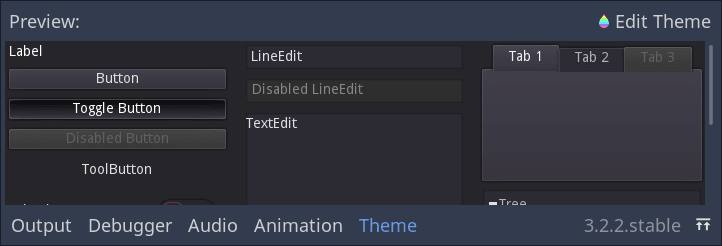
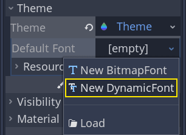
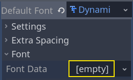
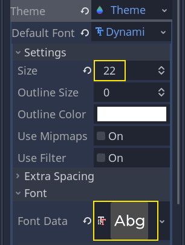
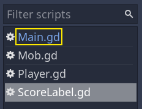
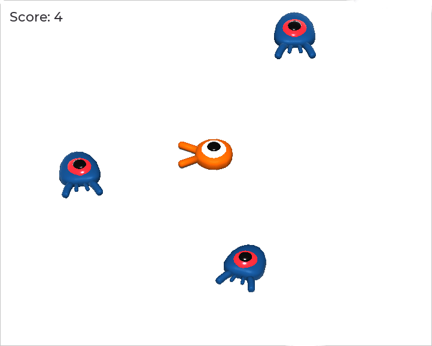
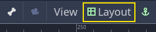
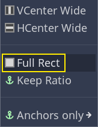
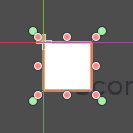
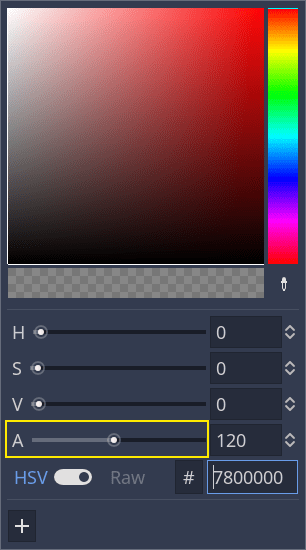
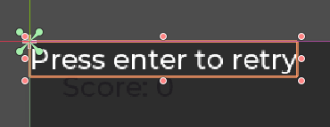
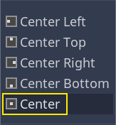
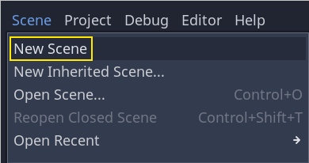
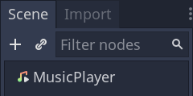
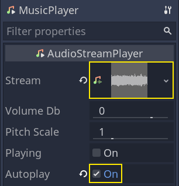
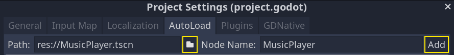
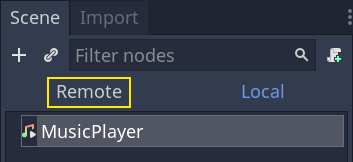
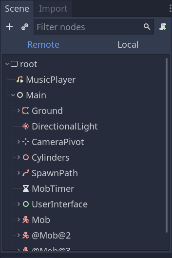
