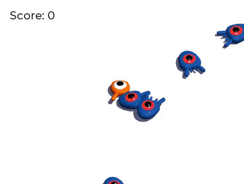

.. _doc_first_3d_game_character_animation:

角色动画
===================

这是最后一课，我们会使用 GaaeExplorer 的内置动画工具制作角色的浮动和拍打动画。你会学
到如何在编辑器中设计动画，以及如何使用代码让游戏变得活灵活现。

|image0|

动画编辑器的使用
--------------------------

该引擎自带的工具可以在编辑器中编写动画。然后你可以在运行时使用代码来播放和控
制它们。

打开玩家场景，选中 ``Player`` 节点，然后添加一个 :ref:`AnimationPlayer 
<class_AnimationPlayer>` 节点。

*动画*\\ 停靠面板就会出现在底部面板中。

|image1|

它的特点是顶部有一个工具栏和动画下拉菜单，中间有一个轨道编辑器，目前是空的，
底部有过滤、捕捉和缩放选项。

让我们来创建一个动画。请点击\\ *动画 -> 新建*\\ 。

|image2|

将动画命名为“float”（漂浮）。

|image3|

创建动画后，将显示时间轴，其中数字表示以秒为单位的时间。

|image4|

我们希望让这个动画在游戏开始时自动开始播放，而且还应该循环播放。

要实现这个需求，可以单击动画工具栏上对应的“A+”图标和循环箭头。

|image5|

你还可以单击右上角的图钉图标，将动画编辑器进行固定。这样它就不会在你点击视口
取消选择节点时折叠。

|image6|

在面板右上角将动画的时长设为 ``1.2`` 秒。

|image7|

你应该看到灰色带子变宽了一点。它显示动画的开始和结束，垂直蓝线是你的时间光
标。

|image8|

单击并拖拽右下角的滑动条，即可将时间线进行缩放。

|image9|

漂浮动画
-------------------

使用动画播放器节点，你可以对所需任意数量的节点的大多数属性做动画。请注意\\ *
检查器*\\ 中属性旁的钥匙图标。在上面单击就可以创建一个关键帧，即对应属性的一
对时间与值。关键帧会被插入到时间线上的时间光标处。

让我们来开始插入帧吧。这里，我们要为 ``Character`` 节点的位置（position）和旋
转（rotation）做动画。

选中 ``Character`` 并在\\ *检查器*\\ 中展开 *Transform* 栏。单击 *Position* 
和 *Rotation* 旁的钥匙图标。

|image10|

编辑器中会出现两个轨道，各有一个代表关键帧的菱形图标。

|image11|

你可以在菱形滑块上单击并拖动，以移动它们的时间。将位置（position ）帧移动到 
``0.3`` 秒处，将旋转（rotation ）帧移动到 ``0.1`` 秒处。

|image12|

在灰色的时间线上单击并拖拽，将时间光标移动至 ``0.5`` 秒位置。

|image13|

为这两个属性分别创建一个关键帧。现在开始在时间线上拖动，将位置（position）的关键帧移动到 ``0.7`` 秒。

|image14|

.. note::

    关于动画原理的讲解已经超出了本教程的范围。请注意，你不想均匀地分配时间和空
间。取而代之的是，动画师使用时间和间隔，这两个核心动画原则。你希望让它们存在
一定的偏移，在角色的运动中产生对比，以使他们感觉生动。

将时间光标移动到动画结尾，即 ``1.2`` 秒。将 Y 平移量设为约 ``0.35``\\ 、X 旋
转量设为 ``-9`` 度。再次为这两个属性添加帧。

单击播放按钮或者按 :kbd:`Shift + D` 即可预览结果。单击停止按钮或者按 :kbd:
`S` 即可停止播放。

|image15|

你可以看到引擎在关键帧之间插值以生成连续动画。不过目前，这个动作感觉非常机器
人化。这是因为默认插值是线性的，导致持续的过渡，这与现实世界中生物的移动方式
不同。

我们可以使用缓动曲线来控制关键帧之间的过渡。

单击并拖拽，框选时间线上的前两个帧。

|image16|

可以在\\ *检查器*\\ 中同时编辑这两个帧的属性，其中就有一个属性叫做 
*Easing*\\ （缓动）。

|image17|

单击并拖动曲线，把它往左拉。这样就会让他实现缓出，也就是说，一开始变得快，然
后时间光标越接近下一个关键帧就变得越慢。

|image18|

再次播放动画以查看差异。前半部分应该已经感觉有点弹性了。

将缓动效果应用于旋转轨迹中的第二个关键帧。

|image19|

对第二个平移关键帧执行相反操作，将其拖动到右侧。

|image20|

你的动画应该类似这样。

|image21|

.. note::

    每一帧，动画都会去更新被动画的节点的属性，覆盖掉初始值。如果我们直接对 
*Player* 节点做动画，就没法使用代码来移动它了。这就是 *Pivot* 节点的用处：尽
管我们为 *Character* 做了动画，我们还是可以在此动画之上，再通过代码来移动并旋
转 *Pivot*\\ 。

如果你运行游戏，玩家的生物就会漂浮起来！

如果这个生物离地面太近了，你可以将 ``Pivot`` 向上移动，达成偏移的目的。

使用代码控制动画
~~~~~~~~~~~~~~~~~~~~~~~~~~~~~~~~~

We can use code to control the animation playback based on the player's input.
Let's change the animation speed when the character is moving.

Open the *Player*'s script by clicking the script icon next to it.

|image22|

我们可以使用代码来根据玩家的输入控制动画的播放。让我们在角色移动时修改动画的
速度吧。

.. tabs::
 .. code-tab:: gdscript GDScript

   func _physics_process(delta):
       #...
       #if direction != Vector3.ZERO:
           #...
           $AnimationPlayer.playback_speed = 4
       else:
           $AnimationPlayer.playback_speed = 1

 .. code-tab:: csharp

    public override void _PhysicsProcess(float delta)
    {
        // ...
        if (direction != Vector3.Zero)
        {
            // ...
            GetNode<AnimationPlayer>(AnimationPlayer).PlaybackSpeed = 4;
        }
        else
        {
            GetNode<AnimationPlayer>(AnimationPlayer).PlaybackSpeed = 1;
        }
    }

这段代码的作用是让玩家在移动时将播放速度乘以 ``4``\\ 。在停止移动时将其恢复原
状。

我们提到 Pivot（轴心）可以在动画之上叠加变换。我们可以用下面这行代码使角色在
跳跃时产生弧线。把它加在 ``_physics_process()`` 的最后。

.. tabs::
 .. code-tab:: gdscript GDScript

   func _physics_process(delta):
       #...
       $Pivot.rotation.x = PI / 6 * velocity.y / jump_impulse

 .. code-tab:: csharp

    public override void _PhysicsProcess(float delta)
    {
        // ...
        var pivot = GetNode<Spatial>(Pivot);
        pivot.Rotation = new Vector3(Mathf.Pi / 6f * _velocity.y / JumpImpulse, pivot.Rotation.y, pivot.Rotation.z);
    }

为小怪制作动画
------------------

在 GaaeExplorer 中还有一个很好的动画技巧：只要你使用类似的节点结构，你就可以把它们复
制到不同的场景中。

例如，\\ ``Mob`` 和 ``Player`` 场景都有 ``Pivot`` 和 ``Character`` 节点，所以
我们可以在它们之间复用动画。

打开 *Player* 场景，选中动画播放器节点，打开“float”（漂浮）动画。然后点击\\ 
**动画 -> 复制**\\ 。然后打开 ``mob.tscn`` ，创建一个 AnimationPlayer 子节点
并选择它。点击\\ **动画 -> 粘贴**\\ ，并确保底部面板的动画编辑器中带有“A+”图
标的按钮（加载时自动播放）和循环箭头（动画循环）也已打开。这样就行了；所有的
怪物现在就都能播放浮动动画了。

我们可以根据生物的 ``random_speed`` 来更改播放速度。打开 *Mob* 的脚本，在 
``initialize()`` 函数的末尾添加下面这行代码。

.. tabs::
 .. code-tab:: gdscript GDScript

   func initialize(start_position, player_position):
       #...
       $AnimationPlayer.playback_speed = random_speed / min_speed

 .. code-tab:: csharp

    public void Initialize(Vector3 startPosition, Vector3 playerPosition)
    {
        // ...
        GetNode<AnimationPlayer>(AnimationPlayer).PlaybackSpeed = randomSpeed / MinSpeed;
    }

这样，你就完成了你第一个完整 3D 游戏的编码。

**恭喜**！

在下一部分，我们将快速复习已学到的内容，并为你提供一些继续学习的链接。不过现
在，这里是完整的 ``Player.gd`` 和 ``Mob.gd``\\ ，你可以用它们来校对你的代码。

这是 *Player* 脚本。

.. tabs::
 .. code-tab:: gdscript GDScript

   extends KinematicBody

   # Emitted when the player was hit by a mob.
   signal hit

   # How fast the player moves in meters per second.
   export var speed = 14
   # The downward acceleration when in the air, in meters per second per second.
   export var fall_acceleration = 75
   # Vertical impulse applied to the character upon jumping in meters per second.
   export var jump_impulse = 20
   # Vertical impulse applied to the character upon bouncing over a mob in meters per second.
   export var bounce_impulse = 16

   var velocity = Vector3.ZERO

   func _physics_process(delta):
       var direction = Vector3.ZERO

       if Input.is_action_pressed(move_right):
           direction.x += 1
       if Input.is_action_pressed(move_left):
           direction.x -= 1
       if Input.is_action_pressed(move_back):
           direction.z += 1
       if Input.is_action_pressed(move_forward):
           direction.z -= 1

       if direction != Vector3.ZERO:
           direction = direction.normalized()
           $Pivot.look_at(translation + direction, Vector3.UP)
           $AnimationPlayer.playback_speed = 4
       else:
           $AnimationPlayer.playback_speed = 1

       velocity.x = direction.x * speed
       velocity.z = direction.z * speed

       # Jumping
       if is_on_floor() and Input.is_action_just_pressed(jump):
           velocity.y += jump_impulse

       velocity.y -= fall_acceleration * delta
       velocity = move_and_slide(velocity, Vector3.UP)

       for index in range(get_slide_count()):
           var collision = get_slide_collision(index)
           if collision.collider.is_in_group(mob):
               var mob = collision.collider
               if Vector3.UP.dot(collision.normal) > 0.1:
                   mob.squash()
                   velocity.y = bounce_impulse

       $Pivot.rotation.x = PI / 6 * velocity.y / jump_impulse

   func die():
       emit_signal(hit)
       queue_free()

   func _on_MobDetector_body_entered(_body):
       die()

 .. code-tab:: csharp

    public class Player : KinematicBody
    {
        // Emitted when the player was hit by a mob.
        [Signal]
        public delegate void Hit();

        // How fast the player moves in meters per second.
        [Export]
        public int Speed = 14;
        // The downward acceleration when in the air, in meters per second squared.
        [Export]
        public int FallAcceleration = 75;
        // Vertical impulse applied to the character upon jumping in meters per second.
        [Export]
        public int JumpImpulse = 20;
        // Vertical impulse applied to the character upon bouncing over a mob in meters per second.
        [Export]
        public int BounceImpulse = 16;

        private Vector3 _velocity = Vector3.Zero;

        public override void _PhysicsProcess(float delta)
        {
            var direction = Vector3.Zero;

            if (Input.IsActionPressed(move_right))
            {
                direction.x += 1f;
            }
            if (Input.IsActionPressed(move_left))
            {
                direction.x -= 1f;
            }
            if (Input.IsActionPressed(move_back))
            {
                direction.z += 1f;
            }
            if (Input.IsActionPressed(move_forward))
            {
                direction.z -= 1f;
            }

            if (direction != Vector3.Zero)
            {
                direction = direction.Normalized();
                GetNode<Spatial>(Pivot).LookAt(Translation + direction, Vector3.Up);
                GetNode<AnimationPlayer>(AnimationPlayer).PlaybackSpeed = 4;
            }
            else
            {
                GetNode<AnimationPlayer>(AnimationPlayer).PlaybackSpeed = 1;
            }

            _velocity.x = direction.x * Speed;
            _velocity.z = direction.z * Speed;

            // Jumping.
            if (IsOnFloor() && Input.IsActionJustPressed(jump))
            {
                _velocity.y += JumpImpulse;
            }

            _velocity.y -= FallAcceleration * delta;
            _velocity = MoveAndSlide(_velocity, Vector3.Up);

            for (int index = 0; index < GetSlideCount(); index++)
            {
                KinematicCollision collision = GetSlideCollision(index);
                if (collision.Collider is Mob mob && mob.IsInGroup(mob))
                {
                    if (Vector3.Up.Dot(collision.Normal) > 0.1f)
                    {
                        mob.Squash();
                        _velocity.y = BounceImpulse;
                    }
                }
            }

            var pivot = GetNode<Spatial>(Pivot);
            pivot.Rotation = new Vector3(Mathf.Pi / 6f * _velocity.y / JumpImpulse, pivot.Rotation.y, pivot.Rotation.z);
        }

        private void Die()
        {
            EmitSignal(nameof(Hit));
            QueueFree();
        }

        public void OnMobDetectorBodyEntered(Node body)
        {
            Die();
        }
    }

这是 *Mob* 的脚本。

.. tabs::
 .. code-tab:: gdscript GDScript

   extends KinematicBody

   # Emitted when the player jumped on the mob.
   signal squashed

   # Minimum speed of the mob in meters per second.
   export var min_speed = 10
   # Maximum speed of the mob in meters per second.
   export var max_speed = 18

   var velocity = Vector3.ZERO

   func _physics_process(_delta):
       move_and_slide(velocity)

   func initialize(start_position, player_position):
       look_at_from_position(start_position, player_position, Vector3.UP)
       rotate_y(rand_range(-PI / 4, PI / 4))

       var random_speed = rand_range(min_speed, max_speed)
       velocity = Vector3.FORWARD * random_speed
       velocity = velocity.rotated(Vector3.UP, rotation.y)

       $AnimationPlayer.playback_speed = random_speed / min_speed

    func squash():
       emit_signal(squashed)
       queue_free()

   func _on_VisibilityNotifier_screen_exited():
       queue_free()

 .. code-tab:: csharp

    public class Mob : KinematicBody
    {
        // Emitted when the played jumped on the mob.
        [Signal]
        public delegate void Squashed();

        // Minimum speed of the mob in meters per second
        [Export]
        public int MinSpeed = 10;
        // Maximum speed of the mob in meters per second
        [Export]
        public int MaxSpeed = 18;

        private Vector3 _velocity = Vector3.Zero;

        public override void _PhysicsProcess(float delta)
        {
            MoveAndSlide(_velocity);
        }

        public void Initialize(Vector3 startPosition, Vector3 playerPosition)
        {
            LookAtFromPosition(startPosition, playerPosition, Vector3.Up);
            RotateY((float)GD.RandRange(-Mathf.Pi / 4.0, Mathf.Pi / 4.0));

            float randomSpeed = (float)GD.RandRange(MinSpeed, MaxSpeed);
            _velocity = Vector3.Forward * randomSpeed;
            _velocity = _velocity.Rotated(Vector3.Up, Rotation.y);

            GetNode<AnimationPlayer>(AnimationPlayer).PlaybackSpeed = randomSpeed / MinSpeed;
        }

        public void Squash()
        {
            EmitSignal(nameof(Squashed));
            QueueFree();
        }

        public void OnVisibilityNotifierScreenExited()
        {
            QueueFree();
        }
    }

.. |image7| image:: img/09.adding_animations/06.animation_duration.png

