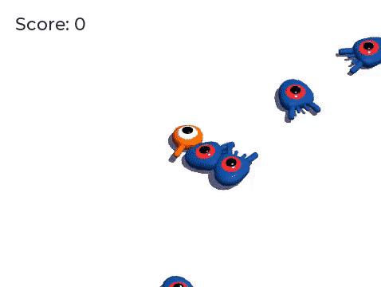

.. _doc_your_first_3d_game:

你的第一个 3D 游戏
==================

在这个渐进式教程系列中，你将会使用 GaaeExplorer 创建你的第一个完整 3D 游戏。在本系列最后，你会完成属于自己的简单项目，类似下面的 GIF 动画。

|image0|

我们要编写的游戏和 :ref:`doc_your_first_2d_game` 差不多，但是：你可以跳起来了，并且目标是把敌人踩扁。这样，你既可以\\ **复习**\\ 之前教程中学到的内容，也可以\\ **以此为基础**\\ 编写新的代码和特性。

你将学到：

- 使用 3D 坐标和跳跃机制。
- 使用运动学实体移动 3D 角色，检测何时何地发生了碰撞。
- 使用物理层和节点组，检测特定实体之间的交互。
- 编写基础的程序玩法，按照固定的时间间隔实例化怪物。
- 设计移动动画，在运行时改变播放速度。
- 在 3D 游戏中绘制用户界面。

以及更多。

本教程是为跟着入门系列一路过来的初学者准备的。开始时我们会慢一点，提供详尽的
指导，后续类似的步骤则会简短一些。如果你是熟练的程序员，可以在这里查看完整的
演示源码：\\ `Squash the Creep 源代码 <https://github.com/godotengine/
godot-3d-dodge-the-creeps>`__\\ 。

.. note::

    你可以在没有做过 2D 的情况下继续学习这个系列。但是，如果你是游戏开发新手，我们建议你从 2D 开始。3D 游戏代码总是比较复杂，而 2D 系列会给你打下基础，让你更轻松地跟上。

我们准备了一些游戏资产，这样我们就可以直接进入代码。你可以在这里下载：\\ 
`Squash the Creeps 资产 <https://github.com/godotengine/godot-3d-dodge-the-
creeps/releases/tag/1.1.0>`__\\ 。

我们将首先为玩家的移动制作一个基本的原型。然后，添加我们将在屏幕周围随机生成的怪物。之后，我们将实现跳跃和压扁机制，然后用一些漂亮的动画来完善游戏。我们将以分数和重玩屏幕结束。

目录
--------

.. toctree::
   :maxdepth: 1
   :name: toc-learn-first_3d_game

   01.game_setup
   02.player_input
   03.player_movement_code
   04.mob_scene
   05.spawning_mobs
   06.jump_and_squash
   07.killing_player
   08.score_and_replay
   09.adding_animations
   going_further

